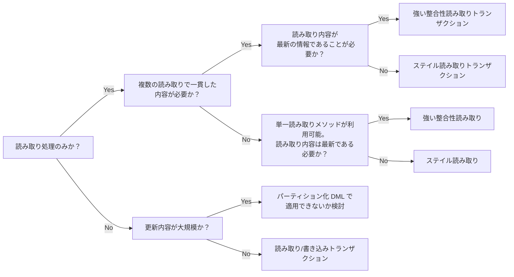

# Cloud Spanner における各種トランザクションの使い分け

## 概要
Cloud Spanner にはトランザクションの実行方法が数種類あります。これらの各方式には使うべき場所やメリット・デメリットがあるため、これらの各方式についての差分を学ぶことでより効率的に Cloud Spanner を利用できます。

Cloud Spanner で利用可能なトランザクションは分類すると以下のパターンがあります。

- 読み取り/書き込みトランザクション
- 読み取り専用トランザクション
  -  強い整合性読み取り
  - ステイル読み取り
- パーティション化 DML

特に断りがない場合、単一リージョン(リージョナル)構成での Cloud Spanner の動作を前提としています。
コードサンプルは Ruby と [Ruby Spanner Client](https://github.com/googleapis/ruby-spanner) での動作を確認しています。

## 読み取り / 書き込みトランザクション(Read/Write transaction)

名前の通り、読み込みと書き込みを含む一連の処理を行うときのトランザクションです。一般的な RDBMS でのトランザクションと同じく複数の処理をまとめたアトミック(原子的)な処理が可能です。

トランザクション中で読み取った範囲に対してセル単位^[1レコード内の1つの列]での読み取り共有ロックを、書き込みには書き込み共有ロックを取得します。また、単一トランザクションで変更できる内容について大きさに一定の上限(40000 ミューテーション^[ミューテーションの説明は本題から外れるため本稿では詳細までは取り扱いませんが、概ね数千行の更新にあたります。詳細は[mutationの 数え方](https://github.com/gcpug/nouhau/tree/master/spanner/note/mutation-count)などを参照ください])があります。この上限を超える処理にはパーティション化 DML を使うことが適しています。

例:
```ruby
client.transaction do |transaction|
  player = "100"
  results = transaction.query("SELECT quantity FROM player_items WHERE player_id=@player AND item_id=@item", 
                               params: { player: player, item: item })
  quantity = results.rows.first[:quantity] + 1
  transaction.execute("UPDATE player_items SET quantity=@quantity WHERE player_id=@player AND item_id=@item",
                            params: { player: player, item: item, quantity: quantity })
end
```

## 読み取り専用トランザクション(Read only transaction)
複数の読み取り処理で一貫した読み取り結果が必要な場合に使うトランザクションです。単発の SQL クエリを実行して結果を得たいだけの場合は、[単一読み取りメソッド](https://cloud.google.com/spanner/docs/reads?hl=ja#single_read_methods)を使うことも可能です。 

読み取り専用トランザクションでは**ロックを必要としません**。つまり読み取り / 書き込みトランザクションも含めて**その他のトランザクションをブロックしません**。

読み取り専用トランザクションと単一読み取りメソッドは実行時にタイムスタンプバウンド(タイムスタンプの境界)を指定できます。この指定方法により強い整合性読み取りかステイル読み取りのいずれかになります。単一読み取りメソッドにもタイムバウンドを指定することが可能で、効果はトランザクションのときと同様です。

### 強い整合性読み取り(Strong read)
タイムスタンプバウンドを指定しないあるいは0と指定した場合、強い整合性のある読み取りとなりデータベースに対して行われた最新の更新を反映した内容が読み取られます。

強い整合性読み取りはトランザクション開始時点の、更新直後に実行されても更新された内容を含んだ結果が取得可能です。読み取り内容の反映に**遅延が許されない場合**にご利用ください。
### ステイル読み取り(Stale read)
タイムスタンプバウンドに正の数を指定した場合、ステイル読み取りとなります。英語の Stale とは「新鮮ではない」という意味です。

タイムスタンプバウンドの指定には2種類あり、現在時刻から正確に過去の秒数を指定する方法(正確なステイルネス、**ExactStaleness**)と現在時刻から指定した秒数までの過去のうち最新の結果を取得する方法(バウンドステイルネス、**MaxStaleness**)があります。このうちバウンドステイルネスは読み取り専用トランザクションでは使えず、単一読み取りメソッドのみで使用可能です。


例:

```ruby
client.snapshot(exact_staleness: 10) do |snap|
  results = snap.query("SELECT quantity FROM player_items WHERE player_id=@player AND item_id=@item", 
                       params: { player: player, item: item })
  puts results.rows.first[:quantity] 
end
```
この実行例では現在時刻よりきっかり 10秒前のスナップショットをとり、それに対して後続のブロックで読み取りを行うという処理です。この例では読み取りは1回のみしか行っていませんが、複数のクエリを実行しても同一のスナップショットに対して実行されるため、トランザクション中での複数のクエリは同じデータの断面への結果が得られます。

ステイル読み取りの使いどころとしては MySQL や PostgreSQL のリードレプリカを使っている処理を代替できるとイメージいただくと良いと思います。MySQL や PostgreSQL のリードレプリカはその実装方法から、レプリカソースで実行された更新内容が遅延して反映されるためリードレプリカ上での内容も遅延します。リードレプリカは遅延が許される処理、例えば EC サイトの商品一覧ページなどのようにアクセスが多く多少の遅延は許容される場面で利用されているかと思います。このような処理をステイル読み取りとして読み替えると効果的です。このとき、遅延が許容されるような複数の読み取りの内容に一貫性が求められることは稀であるため、単一読み取りメソッドをタイムスタンプバウンドの指定で呼び出すとより有効でしょう。

ステイル読み取りは読み取り専用トランザクションの一種であるためロックを取りませんし、後述の仕組みによりパフォーマンス上もメリットがあります。

## パーティション化 DML(Partitioned DML)

パーティション化 DML とはデータ更新の DML (UPDATE, DELETE など)を一括して実行するための仕組みです。DML の内容がべき等であることなどが必要ですが、RW トランザクションでの一括更新できない規模の大きなテーブルの全体に対しても実行可能です。

```ruby
row_count = db.execute_partition_update \
  "UPDATE users SET friends = NULL WHERE active = false",
  request_options: request_options
```

簡単に言うと対象のテーブルを細かい範囲で分割し、その領域ごとに DML を実行するという仕組みです。この仕組み上、処理はアトミックではないことにご留意ください。そのため、厳密にはトランザクションではありません。

パーティション化 DML と似た読み取りの仕組みとして [PartitionQuery](https://cloud.google.com/spanner/docs/reads?hl=ja#read_data_in_parallel) という方法もあります。パーティション化 DML と同じくクエリを小さい単位に区切って並列で実行することでスループットを高めることが期待できます。

## ステイル読み取りはどうして効率的に実行できるのか
Cloud Spanner はデータをスプリットという単位で管理します。各スプリットは3つのゾーンに複製されます。3つの複製のうち、いずれかの一つがリーダー(Leader)として選ばれます。残りの2つはレプリカ(Replica)となります。

強い整合性読み取りを行った場合、読み取りのリクエストは通常は同じゾーンにある最寄りのレプリカが処理を担当します。レプリカは読み取り対象の行が最新であるかをリーダーに確認を行います。レプリカが最新の内容を持っていることが確認できればレプリカ自身の持っている情報で処理が行われ、クライアントへ結果が返されます。レプリカの持っている内容が最新ではない場合、最新への更新を待って結果が返されます。

一方で、ステイル読み取りの場合は最新から一定の時間過去のデータであることを許容します。そのため、レプリカ上のデータで処理が完結することが可能となる場合があります。これにより**ステイル読み取りは強い整合性読み取りと比べてより短い時間で応答される**ことが期待されます。

では、タイムスタンプバウンドとしてどれぐらいを指定すると読み取りレイテンシの短縮に効果があるでしょうか。推奨値は10秒となっており、これより大きい値を指定すると安定してレイテンシの短縮の効果が期待できます。これより小さい値でもレイテンシの削減効果が得られる場合がありますので、実際のアプリケーション要件やワークロードに合わせて小さな値での効果も実地でご確認ください。

読み取りレイテンシの短縮効果は単一リージョン構成でも実感できますが、マルチリージョン構成ではその効果はより大きくなります。これはリーダーとレプリカが地理的に離れた場所に在ることが多く、WAN 越しでのリーダーへの通信を必要とせずレプリカのみで処理が完結することの恩恵が大きいためです。Cloud Spanner を**マルチリージョン構成を利用される場合は特にステイル読み取りを活用**されることをお勧め致します。

参考資料
- [What is Cloud Spanner?](https://cloud.google.com/blog/topics/developers-practitioners/what-cloud-spanner?hl=en)
- [Spanner の読み取りと書き込みのライフサイクル](https://cloud.google.com/spanner/docs/whitepapers/life-of-reads-and-writes?hl=ja)
- [Demystifying Cloud Spanner multi-region configurations](https://cloud.google.com/blog/topics/developers-practitioners/demystifying-cloud-spanner-multi-region-configurations?hl=en)

## どのトランザクションを使えば良いかのフローチャート


