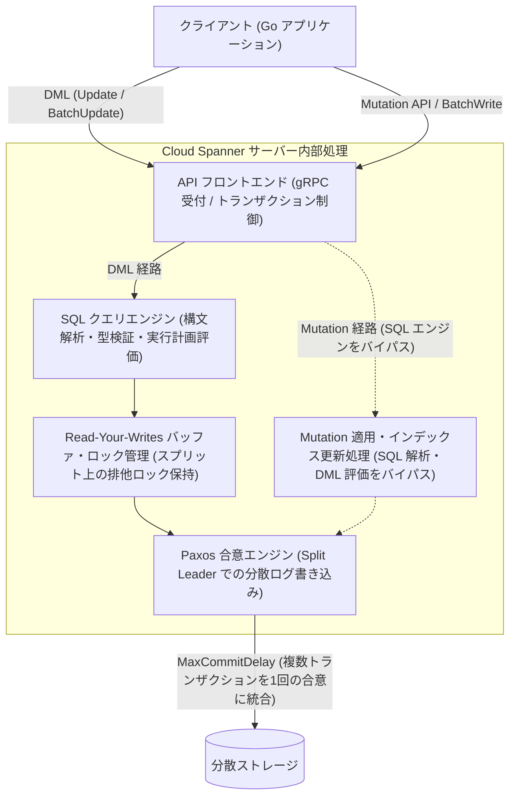
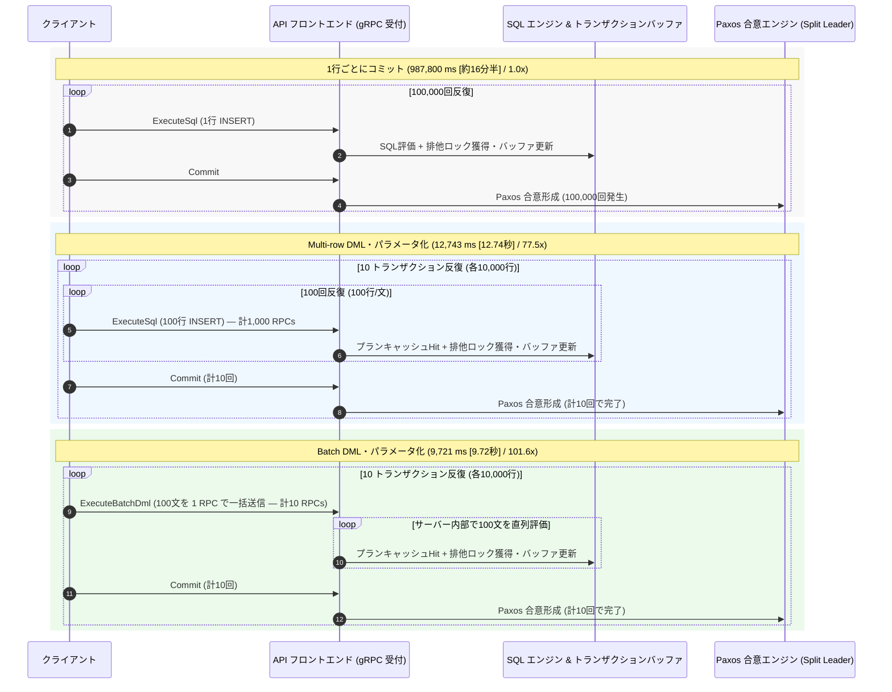
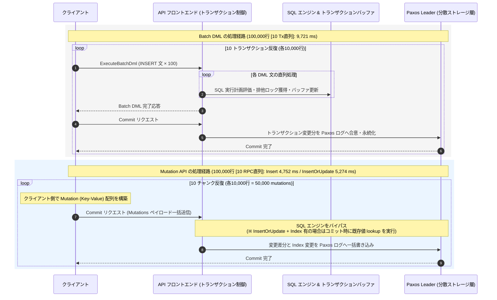
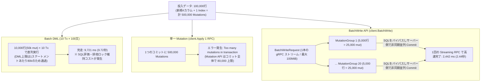
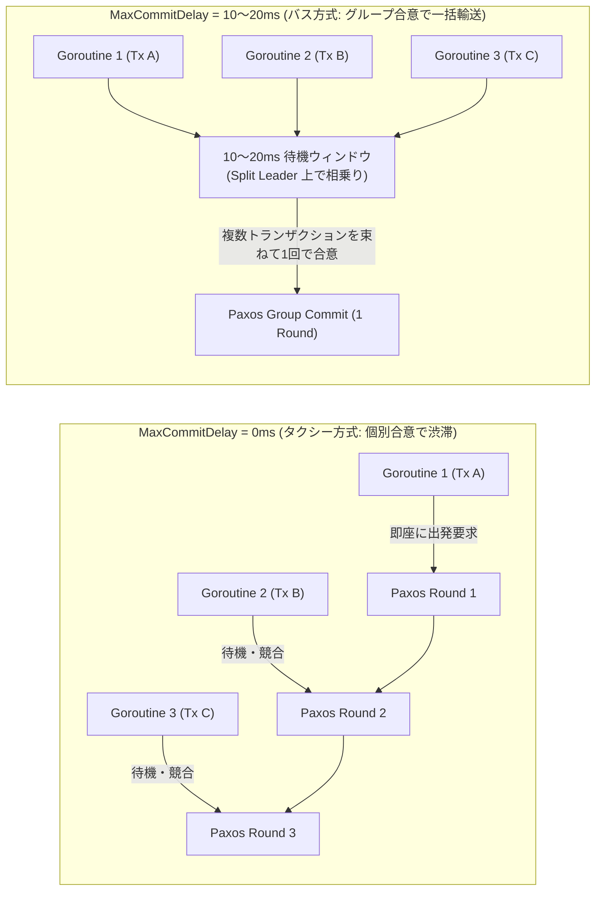
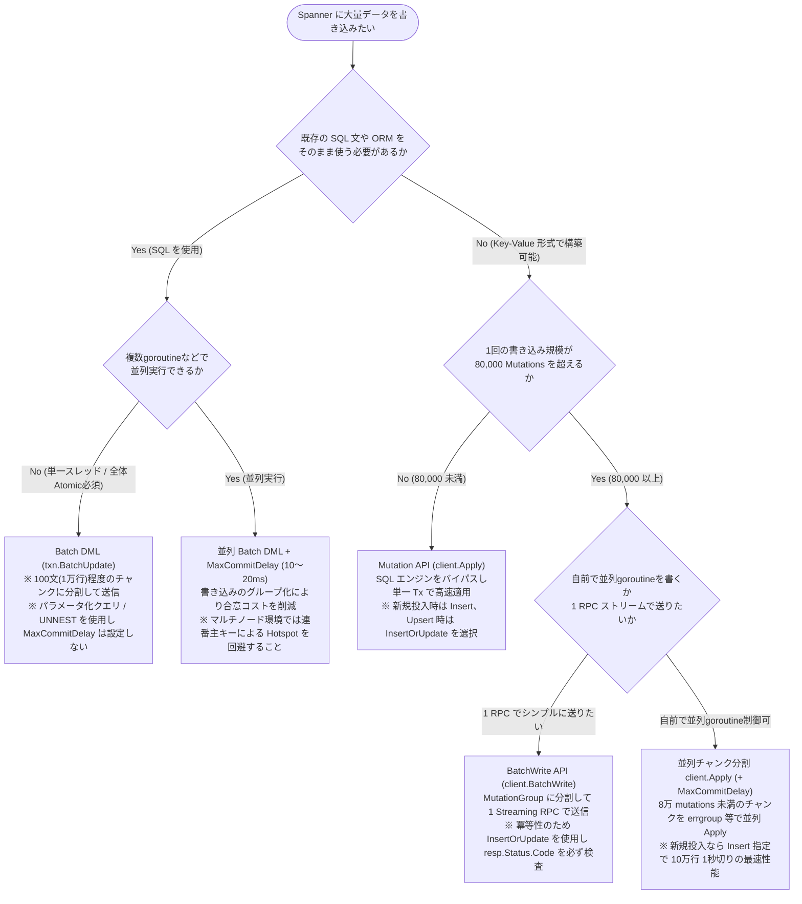

## はじめに

Spanner に対して大量のデータを一括書き込みを行うとき、書き方の違いによって処理時間は大きく変化します。同じ **100,000 行（500,000 mutations）** のデータを書き込む処理であっても、1行ずつコミットする最も素朴な実装では約 988 秒（約 16 分半）を要するのに対し、Spanner のアーキテクチャに沿った手法を選択すれば **0.86 秒〜2.44 秒（約 404〜1,150 倍高速）** で完了します。

本記事では、東京リージョンの 1000 PU（1 Node）実機環境において Go SDK（`cloud.google.com/go/spanner`）で計測した 100,000 行（500,000 mutations）の実測ベンチマーク結果をもとに、バルク書き込みを高速化する手法とその動作原理を段階的に解説します。

非常に細かい内容も解説しておりますので、結論だけ知りたい方は[最後のまとめ](#要件に応じた手法選定フローチャート)をご覧ください。

## 100,000行の書き込みベンチマーク結果と処理階層

まず、検証対象のスキーマと実測結果の全体像を示します。検証には以下の `Players` テーブル（4カラム）とセカンダリインデックス 1 個を使用しました。

```sql
CREATE TABLE Players (
    PlayerId STRING(36) NOT NULL,
    Name     STRING(64) NOT NULL,
    Level    INT64 NOT NULL,
    Score    INT64 NOT NULL
) PRIMARY KEY (PlayerId);

CREATE INDEX PlayersByLevel ON Players (Level DESC);
```

このテーブルに新規の 1 行を INSERT すると、テーブル本体の 4 カラム分の変更とセカンダリインデックス `PlayersByLevel` の 1 エントリ分の追加が同時に発生し、計 5 mutations（変更セル数）を消費します（既存行の更新時はインデックスの削除＋挿入で 6 mutations となる場合があり、詳細は後述します）。今回の検証では、毎回テーブルを空（`clearTable`）にした状態から新規 **100,000 行**を投入するため、**合計 500,000 mutations** に相当します。

100,000 行（500,000 mutations）を各手法で書き込んだ際の実測所要時間と、素朴な実装からの高速化倍率は以下の通りです（SQL 手法はすべてパラメータ化クエリを使用しクエリプランキャッシュがヒットする状態で計測しています）。

| 書き込み手法 | 100,000行の所要時間 | 高速化倍率 | 削減される主なコストと内部挙動 |
| :--- | :---: | :---: | :--- |
| **1. 1行ごとにコミットする DML (基準)** | **987,800 ms** (約987.8秒) | **1.0 倍** | 100,000回のネットワーク往復(RTT) + 100,000回のSQL評価 + 100,000回のPaxos合意 |
| **2. Multi-row INSERT DML** (100行/文 × 1,000 RPCs) | **12,743 ms** (12.74秒) | **77.5 倍** | 10Tx分割でPaxos合意を10回に削減。1,000回のRTTとDML評価が発生（※1Tx一括時は14.03秒、非パラメータ化文字列連結時は **234,970 ms [約235秒]**） |
| **3. Batch DML** (`txn.BatchUpdate`, 100文/RPC × 10 RPCs) | **9,721 ms** (9.72秒) | **101.6 倍** | 10Tx分割でRTTを10回に削減（Multi-row比で約3秒短縮）。DML評価とトランザクションバッファ・排他ロック維持は発生（※1Tx×10RPC時は11.13秒） |
| **4a. Mutation API 単一送信** (`client.Apply` 1 RPC) | **エラー失敗** | — | 500,000 mutations のため、1コミットあたりの上限（**80,000 mutations**）を超過し `InvalidArgument` エラー |
| **4b. Mutation API チャンク分割直列** (`InsertOrUpdate`, 10k行×10 RPCs) | **5,274 ms** (5.27秒) | **187.3 倍** | 10,000行(50k mut)ずつ10回直列Apply。SQL評価をバイパス（※Index整合性のためコミット時に既存値Readが発生） |
| **4c. Mutation API チャンク分割直列** (`Insert`, 10k行×10 RPCs) | **4,752 ms** (4.75秒) | **207.9 倍** | SQL評価をバイパスし、新規挿入確定によりコミット時の既存値Readも回避（直列Batch DML比で **2.05倍高速**） |
| **4d. Mutation API チャンク分割並列** (`Insert`, 10k行×10並列 RPCs) | **964 ms** (0.96秒) | **1,024.7 倍** | 10個のgoroutineでチャンクを並列Apply（`InsertOrUpdate` 時は **1,074 ms [1.07秒 / 919.7倍]**） |
| **5. BatchWrite API** (`MutationGroup` 20個×5k行, 1 Streaming RPC) | **2,442 ms** (2.44秒) | **404.5 倍** | 1本のgRPCストリームで50万mutationsを一括送信。サーバー側でグループ単位の非同期並列Commit（直列Applyの **2.16倍高速**） |
| **6. 並列 Batch DML** (50並列Worker×10Tx[各200行]) + `MaxCommitDelay=10ms` | **1,211 ms** (1.21秒) | **815.7 倍** | 計500回のCommit要求をGroup Commitで少数のPaxos合意に統合（`Delay=0ms` 時は **1,366 ms [1.37秒]**） |
| **7. 並列 Mutation Apply** (50並列Worker×10Tx[各200行]) + `MaxCommitDelay=10ms` | **859 ms** (0.86秒) | **1,149.9 倍** | Mutation経路の50並列500回CommitにGroup Commitを適用（`Delay=0ms` 時は **898 ms [0.90秒]**） |

※ 1行ごとにコミットする DML は 500 行を実測した平均値（9.88 ms/行）からの 100,000 行換算値（987.8秒＝約16分28秒）であり、それ以外の手法はすべて 100,000 行（500,000 mutations）を実機に書き込んだ実測値です。

### Spanner の書き込み処理が通過する階層

なぜ手法によって 987.8 秒から 0.86 秒まで 1,000 倍以上の差が生じるのでしょうか。公式ドキュメント（トランザクションとアーキテクチャ解説）に基づき、Spanner にデータが書き込まれてから永続化されるまでの処理を分解すると、大きく以下の4つの階層に整理できます。

* **API フロントエンド（gRPC フロントエンド / トランザクション制御）**：クライアントと Spanner API サーバー間の通信往復（RTT）を受け付け、トランザクションコーディネータとして後続処理を仲介します。すべてのリクエストはこの層を通過します。
* **SQL クエリエンジン（Query Engine）**：SQL 文字列の構文解析（Parse）、型検証、実行計画の構築（クエリプランキャッシュの参照を含む）を行います。
* **Read-Your-Writes（RYW）バッファ・ロック管理**：同一トランザクション内の後続クエリが「直前に行った未コミットの変更」を読み取れるようにするためのトランザクションバッファ更新と、対象データ範囲（スプリット）に対する排他ロック（Two-Phase Locking）の保持を行います。
* **Paxos 合意エンジン（Split Leader / 分散ストレージ層）**：データの整合性を担保するため、各スプリット（Split）のリーダー（Split Leader）がレプリカ群と分散合意を形成し、Paxos ログへ変更を永続化します。

各書き込み手法がどの階層を通過し、どこをバイパス・効率化しているかを以下の図に示します。



以降では、最も素朴な実装から出発し、これらの階層のコストを段階的に削減していく過程をコードと図解で確認します。

---

## 一般的な SQL の高速化技法（Multi-row DML と Batch DML）

最初は、SQL（DML）を用いた書き込みです。まずは 1 行ずつトランザクションを実行する素朴な実装を確認し、そこに一般的な SQL データベースでも用いられる複数行まとめ（Multi-row INSERT）とバッチ送信（Batch DML）を適用します。

### 1行ごとにトランザクションをコミットする DML（987.8秒 / 基準 1.0倍）

最も素朴な実装は、ループの中で 1 行ごとに `ReadWriteTransaction` を開始し、`INSERT` 文を実行してコミットするコードです。

```go
// 1行ごとに ReadWriteTransaction をコミットする素朴な実装
for _, p := range players {
    _, err := client.ReadWriteTransaction(ctx, func(ctx context.Context, txn *spanner.ReadWriteTransaction) error {
        stmt := spanner.Statement{
            SQL: "INSERT INTO Players (PlayerId, Name, Level, Score) VALUES (@id, @name, @level, @score)",
            Params: map[string]interface{}{
                "id": p.PlayerId, "name": p.Name, "level": p.Level, "score": p.Score,
            },
        }
        _, err := txn.Update(ctx, stmt)
        return err
    })
    if err != nil {
        return err
    }
}
```

この実装では、1 行書き込むごとにクライアントとサーバー間の通信往復（ExecuteSql RPC と Commit RPC）が発生し、サーバー側では毎回 SQL の評価と Paxos 合意（分散ログへの書き込み）が行われます。1 行あたり約 9.88 ms を要するため、100,000 行を直列に処理すると約 **987.8 秒（987,800 ms / 約 16 分 28 秒）** かかります。

### Multi-row INSERT DML による一括実行（12.74秒 / 77.5倍高速）

トランザクションの開始とコミット（Paxos 合意）の回数を減らし、SQL の評価回数を削減するため、1 つの `INSERT` 文の `VALUES` 句に 100 行分のプレースホルダをまとめます（Multi-row INSERT）。

100,000 行（500,000 mutations）を書き込む場合、1 トランザクションあたり 10,000 行（100行×100文＝50,000 mutations）ずつの 10 トランザクションに分割して実行すると、所要時間は 987.8 秒から **12.74 秒（12,743 ms / 77.5倍高速）** に短縮されます。

```go
// 10,000行(50,000 mutations)単位のトランザクション×10回で 100,000行を Multi-row INSERT
for txIdx := 0; txIdx < 10; txIdx++ {
    _, err := client.ReadWriteTransaction(ctx, func(ctx context.Context, txn *spanner.ReadWriteTransaction) error {
        for c := 0; c < 100; c++ {
            rowOffset := (txIdx*100 + c) * 100
            stmt := spanner.Statement{
                SQL:    sql100Template, // 固定のパラメータ化 SQL テンプレート
                Params: buildParameterizedMultiRowParams(players[rowOffset : rowOffset+100]),
            }
            if _, err := txn.Update(ctx, stmt); err != nil {
                return err
            }
        }
        return nil
    })
    if err != nil {
        return err
    }
}
```

> **余談1：パラメータ化クエリ vs 文字列リテラル連結の処理時間差**：
> Multi-row INSERT を実装する際、`fmt.Sprintf("('%s', '%s', %d, %d)", ...)` のように値リテラルを直接 SQL 文字列に埋め込んで構築すると、同じ 100行×1,000文の Multi-row DML でも所要時間は伸びます（パラメータ化時の 約 18.4 倍 の時間がかかります）。
> これは、文字列連結によって SQL テキストが毎回変化・巨大化すると、Spanner サーバー側で **クエリプランキャッシュ（Query Plan Cache）が効かず、毎回巨大な SQL 文字列の字句解析（Lexer）・構文解析（Parser）・実行計画構築がフルに走るため** です（もちろん SQL インジェクションの観点からも文字列連結は避けるべきです）。
> Multi-row DML を用いる際は、必ずプレースホルダ（`@id_0` 等）によるパラメータバインディング、または以下のように構造体配列と `UNNEST` を組み合わせた単一パラメータ化クエリを使用してください。
> ```sql
> INSERT INTO Players (PlayerId, Name, Level, Score)
> SELECT p.PlayerId, p.Name, p.Level, p.Score
> FROM UNNEST(@players) AS p
> ```

> **余談2：1 トランザクションに 50万 mutations を詰め込む（14.03秒）より 10 トランザクションに適切に分割する（12.74秒）方が速い理由**：
> 後述する通り、DML では各ステートメント単位で変更上限が評価されるため、100,000 行（1,000 RPCs / 500,000 mutations）を **1 つの `ReadWriteTransaction`** で実行・コミットすることも仕様上は可能です。しかし実測すると、1 トランザクション一括実行は **14,031 ms（14.03秒）** かかり、10,000 行×10 トランザクションに分割した場合（**12,743 ms / 12.74秒**）よりも遅くなります。
> これは、1 つのトランザクションで 50 万個もの排他ロックとトランザクションバッファを Commit 完了まで保持し続けることで、サーバー側のメモリ・ロック管理コストが増大するためです。大規模な DML バッチでは、公式ドキュメントでも推奨されている通り、1 トランザクションあたり数万 mutations（10,000〜15,000 行程度）の粒度でコミットを区切るのがベストプラクティスです。

### Batch DML による通信往復の削減（9.72秒 / 101.6倍高速）

Multi-row INSERT DML（12.74秒）では、`txn.Update` を合計 1,000 回直列に呼び出しているため、クライアントとサーバー間のネットワーク往復（RTT）が 1,000 回発生していました。この通信往復を削減するには、Spanner の Batch DML（`txn.BatchUpdate`）を使用します。1 トランザクションあたり 100 個の Multi-row INSERT 文をスライスに格納し、1 回の `ExecuteBatchDml` RPC でまとめて送信します（10 トランザクション合計で RPC 往復が 1,000 回から 10 回に削減されます）。

```go
// Batch DML (txn.BatchUpdate) により 100文(10,000行)を 1 RPC で送信 × 10 トランザクション
for txIdx := 0; txIdx < 10; txIdx++ {
    _, err := client.ReadWriteTransaction(ctx, func(ctx context.Context, txn *spanner.ReadWriteTransaction) error {
        stmts := make([]spanner.Statement, 0, 100)
        for c := 0; c < 100; c++ {
            rowOffset := (txIdx*100 + c) * 100
            stmts = append(stmts, spanner.Statement{
                SQL:    sql100Template,
                Params: buildParameterizedMultiRowParams(players[rowOffset : rowOffset+100]),
            })
        }
        // 100文(10,000行分)の DML を 1 回の ExecuteBatchDml RPC で一括送信
        _, err := txn.BatchUpdate(ctx, stmts)
        return err
    })
    if err != nil {
        return err
    }
}
```

`txn.BatchUpdate` を用いることで、DML 送信のネットワーク往復が 1,000 回から 10 回になり、所要時間は 12,743 ms から **9,721 ms（9.72秒 / 素朴な実装比で 101.6倍高速）** へと **約 3.02 秒短縮**されます。

なお、Batch DML でも 1,000 文（100,000行分、パラメータ数 40万個）すべてを **1 回の `BatchUpdate` RPC** に詰め込んで送信すると、単一 gRPC メッセージのペイロード巨大化（シリアライズ・デシリアライズ負荷）と 50万 mutations 分のロック保持が重なり、所要時間は **18,886 ms（18.89秒）** まで悪化します。Batch DML においても、1 回の `BatchUpdate` あたり 100 文前後（数千〜1万行程度）に分割して送信することが重要です。

これら3つの DML 手法における通信回数とサーバー内部処理の違いを以下のシーケンス図にまとめます。違いがわかりにくいですが、ループ処理を必要とする範囲が狭くなっているところに注目ください。



---

## SQL エンジンをバイパスする Mutation API と 80,000 Mutations 上限

Batch DML によってネットワーク往復（10 RPCs）と Paxos 合意回数（10 Commits）は最小化され、クエリプランキャッシュも効いています。それにもかかわらず 100,000 行の処理に 9.72 秒を要しているのは、サーバー内部で「1,000文分の SQL 実行計画評価」と「Read-Your-Writes（RYW）を実現するための排他ロック獲得・トランザクションバッファ更新・インデックス即時評価」が直列に走っているためです。

### Read-Your-Writes（RYW）バッファとトランザクション途中評価のオーバーヘッドとは

公式ドキュメントに記載されている通り、Spanner の読み取り/書き込みトランザクション（`ReadWriteTransaction`）内で DML を実行すると、同一トランザクション内の後続の `SELECT` クエリが「今 INSERT したばかりの未コミット行」や「更新されたセカンダリインデックス」を即座に読み取れる（Read-Your-Writes）ことが保証されます。

そのため、Spanner サーバーは DML を 1 文実行するたびに SQL 実行エンジンを介して変更データを評価し、対象スプリット上の排他ロックを獲得してトランザクションバッファ（未コミット状態）とセカンダリインデックスをリアルタイムに更新し続けます。バルク書き込みのように「データを一方的に流し込むだけで、トランザクションの途中で自分の変更を `SELECT` して読み返す必要がない」場面では、この DML ごとの SQL 評価とトランザクション途中の状態維持管理は純粋なオーバーヘッドとなります。

### Mutation API（`client.Apply`）と 80,000 Mutations の上限仕様

Spanner 特有のインターフェースである Mutation API（Go SDK では `spanner.Insert` / `spanner.InsertOrUpdate` 等と `client.Apply` の組み合わせ）を使用すると、SQL エンジンによる DML 評価と途中の Read-Your-Writes 状態構築を完全にバイパスできます（Mutation による変更はコミット時に一括適用されるため、同一トランザクションの途中で読み返すことはできない仕様ですが、バルク投入ではその分高速になります）。

しかし、ここで Spanner の公式クォータ（割り当てと上限）である **「1 コミットあたり最大 80,000 mutations（および 100 MiB）」** の制限が立ちはだかります。

Spanner における Mutation 数は「行数」ではなく、変更されるセル（カラムおよびセカンダリインデックスのエントリ）の合計数として算出されます。

* **新規 INSERT 時（`Insert`、または未存在キーに対する `InsertOrUpdate`）**：
  本記事の `Players` テーブル（4カラム + セカンダリインデックス 1 個）では、新規挿入 1 行あたりベーステーブル 4 カラム + インデックス 1 エントリ = **計 5 mutations** を消費するため、**16,000 行で 80,000 mutations に到達**します。
* **既存行の更新時（`Update`、または既存キーに対する `InsertOrUpdate`）の注意点**：
  すでに存在する行に対して `InsertOrUpdate` 等を実行し、インデックス対象カラム（`Level`）の値が更新される場合、Spanner はセカンダリインデックスの**古いエントリの `DELETE`（1 mutation）**と**新しいエントリの `INSERT`（1 mutation）**の両方を生成します。したがって、既存行の更新時は 1 行あたり $4 + 1 + 1 = 6$ mutations を消費し、**13,333 行で 80,000 mutations の上限に達します。**

### なぜ DML は 1 トランザクションで 10万行（50万 mutations）完走できたのに、単一 `client.Apply` はエラーになるのか？

公式ドキュメント（DML と Mutation の比較）に記載されている通り、80,000 mutations の上限は使用するインターフェースによって適用される単位が異なります。

* **DML（`Update` / `BatchUpdate`）の場合**：
  DML ステートメントは実行のたびにサーバー側で即座に評価され、トランザクションバッファへ反映されます。そのため、80,000 mutations の上限チェックは **「個々の DML ステートメント単位（1 ステートメントあたり最大 80,000 mutations）」** に対して適用されます。1 文あたりの変更数が上限未満であれば、トランザクション全体の合計が 80,000 mutations を超えても（コミットサイズ上限 100 MiB の範囲内で）1 つのトランザクションとして完走できます。
* **Mutation API（`client.Apply`）の場合**：
  すべての Mutation がクライアント側でバッファリングされ、`Commit` リクエスト時に一括送信・評価されるため、80,000 mutations の上限は **「1 回の `Commit`（トランザクション全体）に含まれる全 Mutation の合計」** に対して厳格に適用されます。そのため、100,000 行（500,000 mutations）のスライスをそのまま単一の `client.Apply` に渡すと、以下の `InvalidArgument` エラーとなり即座に失敗します。

```text
spanner: code = "InvalidArgument", desc = "The transaction contains too many mutations. Insert and update operations count with the multiplicity of the number of columns they affect. ... (Maximum number: 80000)"
```

### チャンク分割 `client.Apply` による高速書き込み（直列: 4.75秒 / 並列: 0.96秒）

したがって、Mutation API（`client.Apply`）で 100,000 行（500,000 mutations）を書き込むには、80,000 mutations 未満となるチャンク（例：10,000行＝50,000 mutations ずつ × 10 チャンク）に分割して `client.Apply` を呼び出します。

```go
// Mutation API (client.Apply) を 10,000行(50,000 mutations)ずつの 10チャンクに分割して実行
cols := []string{"PlayerId", "Name", "Level", "Score"}
chunkSize := 10000 // 10,000行 × 5 mutations = 50,000 mutations (< 80,000上限)

for chunkIdx := 0; chunkIdx < len(players)/chunkSize; chunkIdx++ {
    chunkMuts := make([]*spanner.Mutation, chunkSize)
    for i := 0; i < chunkSize; i++ {
        p := players[chunkIdx*chunkSize+i]
        // 新規投入が確実な場合は spanner.Insert を指定（最速）
        chunkMuts[i] = spanner.Insert(
            "Players",
            cols,
            []interface{}{p.PlayerId, p.Name, p.Level, p.Score},
        )
    }
    if _, err := client.Apply(ctx, chunkMuts); err != nil {
        return err
    }
}
```

SQL エンジンとトランザクション途中の Read-Your-Writes 状態構築をバイパスした結果、同じ 10 トランザクション直列実行であっても、Batch DML の 9,721 ms（9.72秒）から **`spanner.Insert` で 4,752 ms（4.75秒 / 207.9倍高速、Batch DML 比で 2.05倍高速）**、**`spanner.InsertOrUpdate` で 5,274 ms（5.27秒 / 187.3倍高速）** へと半減します。

さらに、この 10 チャンクの `client.Apply` を `errgroup` を用いて 10 並列 goroutine で同時送信すると、所要時間は **`spanner.Insert` で 964 ms（0.96秒 / 1,024.7倍高速）**、**`spanner.InsertOrUpdate` で 1,074 ms（1.07秒 / 919.7倍高速）** まで短縮されます。

> **余談：セカンダリインデックス存在下での `Insert`（4.75秒）と `InsertOrUpdate`（5.27秒）の差が生じる理由**
> 実測結果を見ると、直列・並列ともに `spanner.Insert` の方が `spanner.InsertOrUpdate` より約 10% 高速です。
> これは、**セカンダリインデックス（`PlayersByLevel`）が存在するテーブルに対して `spanner.InsertOrUpdate` を使用した場合、コミット処理時に既存行の確認（内部 Read）が必要になるため** です。
> もし該当の主キー（`PlayerId`）を持つ行がすでに存在しており、その `Level` 値が更新される場合、Spanner はセカンダリインデックス上の古い `Level` エントリを `DELETE` しなければなりません。そのため、`InsertOrUpdate` ではコミット処理時に **対象となる主キーに対してベーステーブルの既存値を読み取る内部 Read（Read-Modify-Write）** が発生します。
> * 初期データ投入（テーブルが空、または主キーの重複がないことが確実な場合）：`spanner.InsertOrUpdate` ではなく `spanner.Insert` を使用してください。旧値確認のためのベーステーブル Read を回避でき、最速で書き込むことができます。
> * リトライ時の冪等性が必要な場合（後述の `BatchWrite` など）：再送時に `AlreadyExists` エラーとなるのを防ぐため、`spanner.InsertOrUpdate` を選択します。

Batch DML とチャンク分割 Mutation API のサーバー内部挙動の対比を以下の図に示します。



---

## 単一ストリームで 80,000 上限を突破する BatchWrite API（2.44秒 / 404.5倍高速）

チャンク分割した `client.Apply` を直列に 10 回呼び出す方法（4.75秒〜5.27秒）では、1 チャンクのコミット完了を待ってから次のチャンクを送信するため、10 回分の通信往復と直列待機が発生していました。かといってアプリケーション側で goroutine プールやリトライ制御を自前で実装するのは手間がかかります。

そこで、80,000 mutations を超える大規模なデータを、自前の並列ワーカーを書くことなく「たった 1 回の gRPC ストリーミング RPC 呼び出し」で流し込むための専用 API が `BatchWrite` API（`client.BatchWrite`）です。

`BatchWrite` API は、互いに独立した複数のトランザクション変更グループ（`MutationGroup`）を 1 本の gRPC ストリーミングリクエストに束ねて送信する機能です。Mutation API の 80,000 mutations 上限は「1 つの `MutationGroup` あたり」に適用されるため、100,000 行（500,000 mutations）を **1 グループ 5,000 行（25,000 mutations）× 20 個の `MutationGroup`** に分割して渡せば、1 回のストリーミング RPC（リクエスト全体の上限は 100 MiB）でエラーなく送信できます。

```go
// BatchWrite API による 100,000行 (500,000 mutations) の 1 Streaming RPC 送信
cols := []string{"PlayerId", "Name", "Level", "Score"}
chunkSize := 5000 // 1グループあたり 5,000行 = 25,000 mutations (< 80,000上限)
var groups []*spanner.MutationGroup

for g := 0; g < len(players)/chunkSize; g++ {
    groupMuts := make([]*spanner.Mutation, chunkSize)
    for i := 0; i < chunkSize; i++ {
        p := players[g*chunkSize+i]
        groupMuts[i] = spanner.InsertOrUpdate(
            "Players",
            cols,
            []interface{}{p.PlayerId, p.Name, p.Level, p.Score},
        )
    }
    groups = append(groups, &spanner.MutationGroup{Mutations: groupMuts})
}

// 20個の MutationGroup (計50万 mutations) を 1本の gRPC ストリームで一括送信
iter := client.BatchWrite(ctx, groups)
for {
    resp, err := iter.Next()
    if errors.Is(err, iterator.Done) {
        break
    }
    if err != nil {
        return fmt.Errorf("BatchWrite stream error: %w", err)
    }
    // 【重要】iter.Next() の err はストリーム通信自体の異常のみを返す。
    // 個別の MutationGroup のコミット成否は必ず resp.Status.Code で判定する（無視すると Silent Data Loss になる）
    if resp.GetStatus().GetCode() != int32(code.Code_OK) {
        st := status.FromProto(resp.GetStatus())
        return fmt.Errorf("mutation group %v failed: %w", resp.GetIndexes(), st.Err())
    }
}
```

Spanner サーバーは受け取った 20 個の `MutationGroup` を内部で非同期・並列にスケジューリングしてコミットし、完了したグループから順次レスポンスストリームへ結果を返します。

100,000 行（500,000 mutations）を書き込んだ際の実測比較は以下の通りです。

* Batch DML（10 Tx 直列, パラメータ化）：**9,721 ms（9.72秒）**
* Mutation API（`client.Apply` 100,000行単一送信）：**エラー失敗**（80,000 mutations 上限超過）
* Mutation API（`client.Apply` 10,000行×10 RPC 直列, `InsertOrUpdate`）：**5,274 ms（5.27秒）**
* BatchWrite API（20 `MutationGroup`s × 5,000行, 1 Streaming RPC）：**2,442 ms（2.44秒 / 素朴な実装比で 404.5倍高速）**
  * 自前で並列 goroutine を書かずとも、1 回のストリーミング呼び出しだけで直列 Batch DML 比 **3.98 倍高速**、直列 Mutation Apply 比 **2.16 倍高速** に 10万行を完走します。

これら3つの方式における 100,000 行（500,000 mutations）処理時の挙動の違いを以下の図に示します。



### BatchWrite API を使用する際の注意点

* **個別グループのエラー判定（`resp.Status` の検査必須）**：コード例の通り、`iter.Next()` が返す `err` は gRPC ストリーム自体の切断等しか報告しません。特定グループの `ABORTED` や `DEADLINE_EXCEEDED` 等は `resp.GetStatus().GetCode()` に格納されるため、必ず `code.Code_OK`（`0`）であるかを検査してください。これを怠ると一部のグループが失敗しても気づかずデータが欠損します。
* **アトミック性の範囲**：1 つの `MutationGroup` の内部（例：親テーブル `Players` とインターリーブ子テーブル `PlayerItems` の同時更新など）はアトミックにコミットされますが、異なる `MutationGroup` 間は独立しており、一部のみがコミットされる可能性があります。
* **冪等な操作（InsertOrUpdate）の指定**：`BatchWrite` は Replay Protection（ネットワーク再送時の二重適用防止）をサポートしていません。通信瞬断等によるリトライ時に同一グループが再適用された場合、`spanner.Insert` を使用していると `AlreadyExists` エラーとなるため、リトライを伴うバルク書き込みでは冪等性のある `spanner.InsertOrUpdate`（Upsert）を使用します。

---

## SQL の並列実行とスループットを最適化した書き込み（MaxCommitDelay）

ここまでの検証で、SQL を介さない Mutation API や BatchWrite API の高速性を確認しました。一方で、実際のアプリケーション開発においては「既存の ORM や SQL ビルダーの資産をそのまま流用したい」「SQL の DEFAULT 値や計算式を使って INSERT したい」といった理由から、DML を使わざるを得ないケースがあります。

### 並列 Batch DML によって生じる Paxos 合意の競合

直列の Batch DML で 100,000 行を処理すると 9,721 ms（9.72秒）かかりました。これを高速化するため、100,000 行を 200 行ずつの 500 トランザクションに分割し、Go の 50 個の並行 goroutine（各ワーカー 10 トランザクション）から同時にパラメータ化 Batch DML を実行すると、所要時間は **1,366 ms（1.37秒 / 素朴な実装比で 723.1倍高速）** まで劇的に短縮されます。

しかし、50 個の goroutine から同一のスプリットリーダー（Split Leader）に対して合計 500 回の Commit 要求が絶え間なく殺到すると、リーダー上で Paxos 合意ラウンドが個別にスケジュールされ、合意キューの待機やレプリカ間の通信競合が発生します。

### MaxCommitDelay による書き込みのグループ化（DML: 1.21秒 / Mutation: 0.86秒）

この並列書き込み時のレプリケーションおよび Paxos 合意コストを削減する機能が、Spanner 公式ドキュメントで「[スループットを最適化した書き込み](https://docs.cloud.google.com/spanner/docs/throughput-optimized-writes?hl=ja)（Throughput optimized writes）」として紹介されている `MaxCommitDelay` オプションです。

公式ドキュメントでは、この機能の動作について「小さな遅延を導入して同じ投票参加者（レプリカ群）へ送る書き込みのグループを収集し、まとめて実行する（executing a group of writes together）ことで計算コストを償却する」と説明されています。これは MySQL などのデータベースにおける Group Commit（グループコミット）に似た仕組みです。

この仕組みは、乗客（トランザクション）を目的地（ストレージのレプリカ群）へ運ぶ際の「タクシー方式」と「バス方式」の違いに例えると直感的に理解できます。

* **タクシー方式（`MaxCommitDelay = 0ms` / デフォルト）**：
  乗客が乗り場（Split Leader）に到着するたびに、1人ずつ個別のタクシー（Paxos 合意ラウンド）を発車させます。乗客が1人しかいないときは待ち時間ゼロで出発できますが、50人の乗客（50並列の goroutine）が一斉に押し寄せると、多数のタクシーが道路や料金所に殺到して渋滞（リーダーの CPU や合意キューの競合）を引き起こし、全員（500トランザクション）を運び終えるまでの総時間が長くなります。
* **バス方式（`MaxCommitDelay = 10ms〜20ms`）**：
  乗り場に「最大 10〜20ms ごとに出発するバス」を待機させます。最初に乗車した人は発車まで最大 10〜20ms 待つことになりますが、その間に駆け込んできた他の乗客を全員 1 台のバス（1回の Paxos 合意ラウンド）に乗せてまとめて出発します。車両の運行回数（レプリカ間の合意通信とログ書き込み回数）が大幅に減るため渋滞が解消され、全員を運び終えるまでの全体時間（スループット）は大きく短縮されます。

どれぐらいの待機時間が最適かは、待機している間に到着する乗客の数と集約により減らせる車両の運行回数に依存します。今回のようにほぼ同時に複数の Commit が到着する場合には、10ms のような小さい待機時間でも十分に集約効果を発揮します。

MaxCommitDeley を指定した処理を実行すると Spanner インスタンス全体のメトリクスでもトランザクションのレイテンシーが上昇しているのが確認できます。これはバルクロード以外の通常の更新処理も遅延していることは意味しません。遅延を許容しない通常の書き込みと遅延を許容する書き込みが同じ Paxos 合意を更新しようとしたときには、即座の反映となるためです。タクシーとバスの例で言えば、急ぎの乗客が来た場合には待機中のバスでもすぐに発車するイメージです。この動作についてのマニュアルでの記述は、以下の箇所です。

https://docs.cloud.google.com/spanner/docs/throughput-optimized-writes?e=48754805&hl=ja#set_mixed_commit_delay_times
> 書き込みのサブセットに対してさまざまな最大 commit 遅延時間を構成できます。これを行うと、Spanner は一連の書き込みで構成されている最短の遅延時間を使用します。

Go SDK で `CommitOptions` に `MaxCommitDelay`（10ms）を指定し、`errgroup` でエラーハンドリングを行いつつ 50 並列（計 500 トランザクション）で 100,000 行の Batch DML を実行するコードは以下の通りです。

```go
// 50並列の Batch DML (各ワーカー 200行×10 Tx = 計500 Commits) に MaxCommitDelay (10ms) を適用
eg, egCtx := errgroup.WithContext(ctx)
workers := 50
txnsPerWorker := 10
rowsPerTxn := 200 // 100行×2文の Batch DML

for w := 0; w < workers; w++ {
    workerIdx := w
    eg.Go(func() error {
        for t := 0; t < txnsPerWorker; t++ {
            baseRow := (workerIdx*txnsPerWorker + t) * rowsPerTxn
            stmts := []spanner.Statement{
                {
                    SQL:    sql100Template,
                    Params: buildParameterizedMultiRowParams(players[baseRow : baseRow+100]),
                },
                {
                    SQL:    sql100Template,
                    Params: buildParameterizedMultiRowParams(players[baseRow+100 : baseRow+200]),
                },
            }
            delay := 10 * time.Millisecond
            opts := spanner.TransactionOptions{
                CommitOptions: spanner.CommitOptions{
                    MaxCommitDelay: &delay,
                },
            }
            _, err := client.ReadWriteTransactionWithOptions(egCtx, func(ctx context.Context, txn *spanner.ReadWriteTransaction) error {
                _, err := txn.BatchUpdate(ctx, stmts)
                return err
            }, opts)
            if err != nil {
                return err
            }
        }
        return nil
    })
}
if err := eg.Wait(); err != nil {
    return err
}
```

> **余談：マルチノード本番環境における連番主キー（Monotonically Increasing Keys）と Hotspot の回避**
> 本記事の検証環境は `1000 PU（1 Node）` であり、すべてのデータ範囲が最初から単一のスプリットリーダー上に配置されているため、`p-000000`〜`p-099999` のような連番主キーに対して 50 並列書き込みを行っても単一リーダー内での集約効果が素直に現れています。
> しかし、複数ノード（例：2 Node 以上）にスケールアウトした本番 Spanner 環境において、辞書順で連続する連番キーやタイムスタンプ先頭キーに対して高並列書き込みを行うと、すべての書き込み負荷が特定の 1 つのスプリット（単一ノード）に集中する「ホットスポット（Hotspot）」が発生し、激しいロック競合を引き起こします。
> マルチノード環境でバルク書き込みの並列性能を引き出すには、公式のベストプラクティスに従い、主キーの先頭にハッシュプレフィックス（シャードID）を付与するか、UUID v4 やビット反転値（Bit-reversed sequence）を採用して、書き込みが複数のスプリット（複数ノード）へ均等に分散されるスキーマ設計とすることをお勧めします。

100,000 行（500 トランザクション並列実行）において `MaxCommitDelay` の有無を比較した実測結果は以下の通りです。

* 並列 Batch DML（50並列 × 10 Tx = 500 Commits）：
  * `MaxCommitDelay = 0ms`（タクシー方式）：**1,366 ms（1.37秒 / 723.1倍高速）**
  * `MaxCommitDelay = 10ms`（バス方式）：**1,211 ms（1.21秒 / 815.7倍高速、0ms 比で 11.3% 短縮）**
  * `MaxCommitDelay = 20ms`（バス方式）：**1,223 ms（1.22秒 / 807.7倍高速）**
* 並列 Mutation API（`client.Apply` 50並列 × 10 Tx = 500 Commits, `Insert`）：
  * `MaxCommitDelay = 0ms`：**898 ms（0.90秒 / 1,100.0倍高速）**
  * `MaxCommitDelay = 10ms`（`spanner.ApplyCommitOptions` 指定）：**859 ms（0.86秒 / 1,149.9倍高速）**

`MaxCommitDelay = 10ms` を指定することで、500 回のトランザクションコミットが少数の Paxos 合意ラウンドに統合され、DML 経路では 1.37 秒から **1.21 秒**へ、Mutation 経路では 0.90 秒から **0.86 秒（10万行の書き込みで1秒切り）** へと高速化されます。この動作原理を以下の図に示します。



### 単一スレッド（直列実行）で MaxCommitDelay を設定してはいけない理由

先ほどのタクシーとバス方式の例えを使うと、単一 goroutine による直列実行（前のトランザクションの Commit 完了を待ってから次のトランザクションを開始するループ）で `MaxCommitDelay` を設定してはいけない理由も明確になります。

1人ずつ順番にしか乗客が来ない状況（直列実行）でバス方式（`MaxCommitDelay = 20ms`）にすると、バスは他に相乗りする乗客が誰も来ないにもかかわらず、毎回律儀に 20ms 扉を開けて発車を待ち続けます。実際に 100,000 行を 50 トランザクション（各 2,000 行）に分け、1 goroutine で直列実行した際の実測比較は以下の通りです。

* 直列 Batch DML（50 Txns 直列, `MaxCommitDelay = 0ms`）：**13,328 ms（13.33秒）**
* 直列 Batch DML（50 Txns 直列, `MaxCommitDelay = 20ms`）：**14,435 ms（14.44秒 / +1,107 ms の遅延増加）**

直列実行では、50 回のコミットに対して `50 Tx × 20ms = 1,000 ms`（約 1.1 秒）の待機ペナルティがそのまま純粋な遅延として加算されます。`MaxCommitDelay` は必ず複数ワーカーからの並列書き込み時にのみ指定してください。

---

## まとめとバルク書き込み手法の選定フローチャート

本記事で解説したバルク書き込み手法の特性と、1000 PU 実機環境における 100,000 行書き込みの性能比較一覧を以下にまとめます。

| 書き込み手法 | 100,000行 (500k mut) 所要時間 | 高速化倍率 | SQL/ORM 流用 | トランザクション原子性 | 適したユースケース |
| :--- | :---: | :---: | :---: | :---: | :--- |
| **1. 1行ごと DML Commit (基準)** | **987,800 ms** (約16分28秒) | **1.0x** | 可 | 1行単位 | バッチ・テスト投入では非推奨 |
| **2. Multi-row DML (パラメータ化)** | **12,743 ms** (12.74秒) | **77.5x** | 可 | チャンク / 全体 | 簡易な SQL 一括実行（※非パラメータ化時は約235秒） |
| **3. Batch DML (`BatchUpdate`)** | **9,721 ms** (9.72秒) | **101.6x** | 可 | チャンク / 全体 | SQL を使いつつ RTT を削減したい場合 |
| **4a. Mutation API 単一送信** | **エラー失敗** (80k上限超過) | — | 不可 (Key-Value) | 全体で Atomic | 8万 mutations (本例では16,000行) を超える場合は単一送信不可 |
| **4b. Mutation API チャンク直列 (`InsertOrUpdate`)** | **5,274 ms** (5.27秒) | **187.3x** | 不可 (Key-Value) | 10k行チャンク単位 | Upsert による確実な直列チャンク投入 |
| **4c. Mutation API チャンク直列 (`Insert`)** | **4,752 ms** (4.75秒) | **207.9x** | 不可 (Key-Value) | 10k行チャンク単位 | 新規データの直列チャンク投入（Index Read 回避で高速） |
| **4d. Mutation API チャンク並列 (`Insert`)** | **964 ms** (0.96秒) | **1,024.7x** | 不可 (Key-Value) | 10k行チャンク単位 | 10並列 goroutine による高速チャンク投入 |
| **5. BatchWrite API (`MutationGroup`)** | **2,442 ms** (2.44秒) | **404.5x** | 不可 (Key-Value) | グループ単位 | 自前で並列化せず **1 Streaming RPC** で 8万 mut 超を高速投入 |
| **6. 並列 Batch DML + `MaxCommitDelay=10ms`** | **1,211 ms** (1.21秒) | **815.7x** | 可 | 200行ワーカー単位 | 既存 SQL/ORM 資産を高並列化して最速投入する場合 |
| **7. 並列 Mutation Apply + `MaxCommitDelay=10ms`** | **859 ms** (0.86秒) | **1,149.9x** | 不可 (Key-Value) | 200行ワーカー単位 | 高並列 Mutation トランザクションのスループット最大化 |

### 要件に応じた手法選定フローチャート

Spanner へのバルク書き込みを実装する際は、以下のフローチャートに沿って手法を選定できます。

個人的な好みとしては、最速まで目指さないのであれば **Batch DML + MaxCommitDeley が十分に高速でメンテナンス性とのバランスが良い**と感じています。
その処理を長期的に使い続ける、大量のデータを扱う事がわかっている、Mutation API に抵抗がない場合には並列 Mutation Apply で最速を目指すのが良いでしょう。
Go は gorutine という使いやすい並列処理の仕組みがあるためカジュアルに並列処理を行いましたが、実装言語の関係などで並列処理をアプリケーション側で簡単に記述するのが難しい場合には `BatchWrite API` も有力です。



### 補足：バルク削除（クリーンアップ）における Mutation の優位性

データの投入だけでなく、テストケース間などでテーブル内の全データを削除（クリーンアップ）する際にも DML と Mutation の内部動作の違いが現れます。

DML で `DELETE FROM Players WHERE true` を実行すると、サーバー内部で既存行のテーブルスキャンと個別ロック獲得が発生し、100,000 行の削除には数秒を要します。一方、Mutation API で `spanner.Delete("Players", spanner.AllKeys())` を実行すると、行のスキャンを一切行わず、ストレージエンジンに対してキー空間全体（`[-∞, +∞]`）に対する削除マーカー（Range Tombstone / キー範囲削除）を 1 つ書き込むだけで即座に完了します。さらに子テーブルが `INTERLEAVE IN PARENT Players ON DELETE CASCADE` で定義されていれば、親テーブルへの `AllKeys()` 削除 1 回で子テーブルとセカンダリインデックスも含めて 10ms 未満で初期化できます。

---

## 付録：100,000行 実機ベンチマーク測定コード全文（Go）

本記事の 100,000 行（500,000 mutations）実測値を再現するための Go ベンチマークコード（`cloud.google.com/go/spanner` v1.95.1）の全文は以下の通りです。SQL インジェクション防止およびクエリプランキャッシュ活用のためパラメータ化クエリを使用し、`BatchWrite` の個別グループステータス検査（`resp.Status.Code`）および `errgroup` による並行エラー捕捉を組み込んでいます。

:::details コード全文

```go
package main

import (
	"context"
	"errors"
	"fmt"
	"log"
	"os"
	"strings"
	"time"

	"cloud.google.com/go/spanner"
	"golang.org/x/sync/errgroup"
	"google.golang.org/api/iterator"
	"google.golang.org/genproto/googleapis/rpc/code"
	"google.golang.org/grpc/status"
)

const (
	totalRows   = 100000 // 100,000 rows * 5 mutations/row = 500,000 mutations
	sampleNaive = 500    // 1行ごとコミットの計測サンプル数
)

type Player struct {
	PlayerId string
	Name     string
	Level    int64
	Score    int64
}

func generatePlayers(n int) []Player {
	players := make([]Player, n)
	for i := 0; i < n; i++ {
		players[i] = Player{
			PlayerId: fmt.Sprintf("p-%06d", i),
			Name:     fmt.Sprintf("Player_%d", i),
			Level:    int64(i % 100),
			Score:    int64(i * 10),
		}
	}
	return players
}

// buildParameterizedMultiRowTemplate は SQL 文字列を固定化してクエリプランキャッシュを 100% ヒットさせるためのテンプレートを生成します。
func buildParameterizedMultiRowTemplate(chunkSize int) string {
	var sb strings.Builder
	sb.WriteString("INSERT INTO Players (PlayerId, Name, Level, Score) VALUES ")
	for i := 0; i < chunkSize; i++ {
		if i > 0 {
			sb.WriteString(", ")
		}
		sb.WriteString(fmt.Sprintf("(@id_%d, @name_%d, @level_%d, @score_%d)", i, i, i, i))
	}
	return sb.String()
}

func buildParameterizedMultiRowParams(chunk []Player) map[string]interface{} {
	params := make(map[string]interface{}, len(chunk)*4)
	for i, p := range chunk {
		params[fmt.Sprintf("id_%d", i)] = p.PlayerId
		params[fmt.Sprintf("name_%d", i)] = p.Name
		params[fmt.Sprintf("level_%d", i)] = p.Level
		params[fmt.Sprintf("score_%d", i)] = p.Score
	}
	return params
}

// clearTable はキー範囲削除 (AllKeys) を用いて O(1) でテーブルとインデックスを即座に空にします。
func clearTable(ctx context.Context, client *spanner.Client) error {
	_, err := client.Apply(ctx, []*spanner.Mutation{
		spanner.Delete("Players", spanner.AllKeys()),
	})
	return err
}

func main() {
	dbPath := os.Getenv("SPANNER_DATABASE")
	if dbPath == "" {
		log.Fatal("SPANNER_DATABASE environment variable is required")
	}

	ctx := context.Background()
	client, err := spanner.NewClient(ctx, dbPath)
	if err != nil {
		log.Fatalf("Failed to create client: %v", err)
	}
	defer client.Close()

	players := generatePlayers(totalRows)
	sql100 := buildParameterizedMultiRowTemplate(100)

	// Warmup session pool & query plan cache
	_ = clearTable(ctx, client)
	for w := 0; w < 5; w++ {
		_, _ = client.ReadWriteTransaction(ctx, func(ctx context.Context, txn *spanner.ReadWriteTransaction) error {
			_, err := txn.Update(ctx, spanner.Statement{
				SQL:    sql100,
				Params: buildParameterizedMultiRowParams(players[0:100]),
			})
			return err
		})
		_ = clearTable(ctx, client)
	}

	fmt.Println("=== Spanner 100,000 Rows (500,000 mutations) Benchmark ===")

	// 1. Naive 1-row Commit DML (500 rows sample -> 100,000 rows extrapolated)
	_ = clearTable(ctx, client)
	t0 := time.Now()
	for i := 0; i < sampleNaive; i++ {
		p := players[i]
		_, err := client.ReadWriteTransaction(ctx, func(ctx context.Context, txn *spanner.ReadWriteTransaction) error {
			stmt := spanner.Statement{
				SQL: "INSERT INTO Players (PlayerId, Name, Level, Score) VALUES (@id, @name, @level, @score)",
				Params: map[string]interface{}{
					"id": p.PlayerId, "name": p.Name, "level": p.Level, "score": p.Score,
				},
			}
			_, err := txn.Update(ctx, stmt)
			return err
		})
		if err != nil {
			log.Fatalf("Naive DML failed: %v", err)
		}
	}
	naiveSampleMs := time.Since(t0).Milliseconds()
	perRowMs := float64(naiveSampleMs) / float64(sampleNaive)
	estNaive100kMs := perRowMs * float64(totalRows)
	fmt.Printf("[1. Naive 1-row Commit DML] 500 rows: %d ms -> 100,000 rows extrapolated: %.0f ms (%.1f s, %.2f ms/row)\n",
		naiveSampleMs, estNaive100kMs, estNaive100kMs/1000.0, perRowMs)

	// 2. Multi-row INSERT DML (10 Txns x 100 RPCs = 1,000 RPCs, Parameterized)
	_ = clearTable(ctx, client)
	t0 = time.Now()
	for txIdx := 0; txIdx < 10; txIdx++ {
		_, err := client.ReadWriteTransaction(ctx, func(ctx context.Context, txn *spanner.ReadWriteTransaction) error {
			for c := 0; c < 100; c++ {
				rowOffset := (txIdx*100 + c) * 100
				stmt := spanner.Statement{
					SQL:    sql100,
					Params: buildParameterizedMultiRowParams(players[rowOffset : rowOffset+100]),
				}
				if _, err := txn.Update(ctx, stmt); err != nil {
					return err
				}
			}
			return nil
		})
		if err != nil {
			log.Fatalf("Multi-row DML 10 Txns failed: %v", err)
		}
	}
	multiRow10TxMs := time.Since(t0).Milliseconds()
	fmt.Printf("[2. Multi-row INSERT DML (10 Txns x 100 RPCs, Parameterized)] elapsed=%d ms (%.2f s, %.1fx speedup)\n",
		multiRow10TxMs, float64(multiRow10TxMs)/1000.0, estNaive100kMs/float64(multiRow10TxMs))

	// 3. Batch DML (10 Txns x 1 BatchUpdate RPC = 10 RPCs, Parameterized)
	_ = clearTable(ctx, client)
	t0 = time.Now()
	for txIdx := 0; txIdx < 10; txIdx++ {
		_, err := client.ReadWriteTransaction(ctx, func(ctx context.Context, txn *spanner.ReadWriteTransaction) error {
			stmts := make([]spanner.Statement, 0, 100)
			for c := 0; c < 100; c++ {
				rowOffset := (txIdx*100 + c) * 100
				stmts = append(stmts, spanner.Statement{
					SQL:    sql100,
					Params: buildParameterizedMultiRowParams(players[rowOffset : rowOffset+100]),
				})
			}
			_, err := txn.BatchUpdate(ctx, stmts)
			return err
		})
		if err != nil {
			log.Fatalf("Batch DML 10 Txns failed: %v", err)
		}
	}
	batchDml10TxMs := time.Since(t0).Milliseconds()
	fmt.Printf("[3. Batch DML (10 Txns x 1 BatchUpdate RPC)] elapsed=%d ms (%.2f s, %.1fx speedup)\n",
		batchDml10TxMs, float64(batchDml10TxMs)/1000.0, estNaive100kMs/float64(batchDml10TxMs))

	// 4a. Mutation API - Single Apply of 100,000 rows (500,000 mutations -> expected error)
	_ = clearTable(ctx, client)
	cols := []string{"PlayerId", "Name", "Level", "Score"}
	muts100k := make([]*spanner.Mutation, totalRows)
	for i, p := range players {
		muts100k[i] = spanner.Insert("Players", cols, []interface{}{p.PlayerId, p.Name, p.Level, p.Score})
	}
	_, err = client.Apply(ctx, muts100k)
	fmt.Printf("[4a. Mutation API Single Apply (500k muts)] expected error: %v\n", err)

	// 4b. Mutation API - Sequential Chunked Apply (10 RPCs x 10,000 rows = 50,000 muts/RPC) - InsertOrUpdate
	_ = clearTable(ctx, client)
	t0 = time.Now()
	for chunkIdx := 0; chunkIdx < 10; chunkIdx++ {
		chunkMuts := make([]*spanner.Mutation, 10000)
		for i := 0; i < 10000; i++ {
			p := players[chunkIdx*10000+i]
			chunkMuts[i] = spanner.InsertOrUpdate("Players", cols, []interface{}{p.PlayerId, p.Name, p.Level, p.Score})
		}
		if _, err := client.Apply(ctx, chunkMuts); err != nil {
			log.Fatalf("Sequential Chunked Apply (InsertOrUpdate) failed: %v", err)
		}
	}
	mutSeqUpsertMs := time.Since(t0).Milliseconds()
	fmt.Printf("[4b. Mutation API - InsertOrUpdate (10 sequential RPCs)] elapsed=%d ms (%.2f s, %.1fx speedup)\n",
		mutSeqUpsertMs, float64(mutSeqUpsertMs)/1000.0, estNaive100kMs/float64(mutSeqUpsertMs))

	// 4c. Mutation API - Sequential Chunked Apply (10 RPCs x 10,000 rows = 50,000 muts/RPC) - Insert
	_ = clearTable(ctx, client)
	t0 = time.Now()
	for chunkIdx := 0; chunkIdx < 10; chunkIdx++ {
		chunkMuts := make([]*spanner.Mutation, 10000)
		for i := 0; i < 10000; i++ {
			p := players[chunkIdx*10000+i]
			chunkMuts[i] = spanner.Insert("Players", cols, []interface{}{p.PlayerId, p.Name, p.Level, p.Score})
		}
		if _, err := client.Apply(ctx, chunkMuts); err != nil {
			log.Fatalf("Sequential Chunked Apply (Insert) failed: %v", err)
		}
	}
	mutSeqInsertMs := time.Since(t0).Milliseconds()
	fmt.Printf("[4c. Mutation API - Insert (10 sequential RPCs)] elapsed=%d ms (%.2f s, %.1fx speedup)\n",
		mutSeqInsertMs, float64(mutSeqInsertMs)/1000.0, estNaive100kMs/float64(mutSeqInsertMs))

	// 4d. Mutation API - Parallel Chunked Apply (10 concurrent RPCs x 10,000 rows) - Insert
	_ = clearTable(ctx, client)
	t0 = time.Now()
	{
		eg, egCtx := errgroup.WithContext(ctx)
		for chunkIdx := 0; chunkIdx < 10; chunkIdx++ {
			cIdx := chunkIdx
			eg.Go(func() error {
				chunkMuts := make([]*spanner.Mutation, 10000)
				for i := 0; i < 10000; i++ {
					p := players[cIdx*10000+i]
					chunkMuts[i] = spanner.Insert("Players", cols, []interface{}{p.PlayerId, p.Name, p.Level, p.Score})
				}
				_, err := client.Apply(egCtx, chunkMuts)
				return err
			})
		}
		if err := eg.Wait(); err != nil {
			log.Fatalf("Parallel Chunked Apply (Insert) failed: %v", err)
		}
	}
	mutParInsertMs := time.Since(t0).Milliseconds()
	fmt.Printf("[4d. Mutation API - Insert (10 parallel RPCs)] elapsed=%d ms (%.2f s, %.1fx speedup)\n",
		mutParInsertMs, float64(mutParInsertMs)/1000.0, estNaive100kMs/float64(mutParInsertMs))

	// 5. BatchWrite API (20 MutationGroups x 5,000 rows = 25,000 muts/group in 1 Streaming RPC)
	_ = clearTable(ctx, client)
	mgs20Upsert := make([]*spanner.MutationGroup, 20)
	for g := 0; g < 20; g++ {
		groupMuts := make([]*spanner.Mutation, 5000)
		for i := 0; i < 5000; i++ {
			p := players[g*5000+i]
			groupMuts[i] = spanner.InsertOrUpdate("Players", cols, []interface{}{p.PlayerId, p.Name, p.Level, p.Score})
		}
		mgs20Upsert[g] = &spanner.MutationGroup{Mutations: groupMuts}
	}
	t0 = time.Now()
	iterBW20 := client.BatchWrite(ctx, mgs20Upsert)
	for {
		resp, err := iterBW20.Next()
		if errors.Is(err, iterator.Done) {
			break
		}
		if err != nil {
			log.Fatalf("BatchWrite 20g stream failed: %v", err)
		}
		if resp.GetStatus().GetCode() != int32(code.Code_OK) {
			st := status.FromProto(resp.GetStatus())
			log.Fatalf("BatchWrite 20g group %v failed: %v", resp.GetIndexes(), st.Err())
		}
	}
	bw20UpsertMs := time.Since(t0).Milliseconds()
	fmt.Printf("[5. BatchWrite API - InsertOrUpdate (20 groups in 1 Streaming RPC)] elapsed=%d ms (%.2f s, %.1fx speedup)\n",
		bw20UpsertMs, float64(bw20UpsertMs)/1000.0, estNaive100kMs/float64(bw20UpsertMs))

	// 6. Parallel Batch DML: 50 workers x 10 Txns of 200 rows (= 500 Commits total, 100,000 rows)
	fmt.Println("\n=== MaxCommitDelay Comparison: 50 workers x 10 Txns of 200 rows (500 Commits total) ===")
	for _, d := range []time.Duration{0, 10 * time.Millisecond, 20 * time.Millisecond} {
		_ = clearTable(ctx, client)
		tStart := time.Now()
		eg, egCtx := errgroup.WithContext(ctx)
		workers := 50
		txnsPerWorker := 10
		rowsPerTxn := 200 // 2 stmts of 100 rows
		for w := 0; w < workers; w++ {
			workerIdx := w
			eg.Go(func() error {
				for t := 0; t < txnsPerWorker; t++ {
					baseRow := (workerIdx*txnsPerWorker + t) * rowsPerTxn
					stmts := []spanner.Statement{
						{
							SQL:    sql100,
							Params: buildParameterizedMultiRowParams(players[baseRow : baseRow+100]),
						},
						{
							SQL:    sql100,
							Params: buildParameterizedMultiRowParams(players[baseRow+100 : baseRow+200]),
						},
					}
					opts := spanner.TransactionOptions{}
					if d > 0 {
						opts.CommitOptions = spanner.CommitOptions{MaxCommitDelay: &d}
					}
					_, err := client.ReadWriteTransactionWithOptions(egCtx, func(ctx context.Context, txn *spanner.ReadWriteTransaction) error {
						_, err := txn.BatchUpdate(ctx, stmts)
						return err
					}, opts)
					if err != nil {
						return err
					}
				}
				return nil
			})
		}
		if err := eg.Wait(); err != nil {
			log.Fatalf("Parallel 500 Txns Batch DML failed (delay=%v): %v", d, err)
		}
		el := time.Since(tStart).Milliseconds()
		fmt.Printf("[6a. Parallel Batch DML (50 workers x 10 Txns)] MaxCommitDelay=%v: %d ms (%.2f s, %.1fx speedup)\n",
			d, el, float64(el)/1000.0, estNaive100kMs/float64(el))
	}

	// 7. Parallel Mutation Apply: 50 workers x 10 Txns of 200 rows (= 500 Commits total, 100,000 rows)
	for _, d := range []time.Duration{0, 10 * time.Millisecond, 20 * time.Millisecond} {
		_ = clearTable(ctx, client)
		tStart := time.Now()
		eg, egCtx := errgroup.WithContext(ctx)
		workers := 50
		txnsPerWorker := 10
		rowsPerTxn := 200
		for w := 0; w < workers; w++ {
			workerIdx := w
			eg.Go(func() error {
				for t := 0; t < txnsPerWorker; t++ {
					baseRow := (workerIdx*txnsPerWorker + t) * rowsPerTxn
					muts := make([]*spanner.Mutation, rowsPerTxn)
					for i := 0; i < rowsPerTxn; i++ {
						p := players[baseRow+i]
						muts[i] = spanner.Insert("Players", cols, []interface{}{p.PlayerId, p.Name, p.Level, p.Score})
					}
					var opts []spanner.ApplyOption
					if d > 0 {
						opts = append(opts, spanner.ApplyCommitOptions(spanner.CommitOptions{MaxCommitDelay: &d}))
					}
					if _, err := client.Apply(egCtx, muts, opts...); err != nil {
						return err
					}
				}
				return nil
			})
		}
		if err := eg.Wait(); err != nil {
			log.Fatalf("Parallel 500 Commits Apply failed (delay=%v): %v", d, err)
		}
		el := time.Since(tStart).Milliseconds()
		fmt.Printf("[6b. Parallel Mutation Apply (50 workers x 10 Txns)] MaxCommitDelay=%v: %d ms (%.2f s, %.1fx speedup)\n",
			d, el, float64(el)/1000.0, estNaive100kMs/float64(el))
	}

	// 8. Serial Batch DML Anti-pattern Verification (1 worker, 50 Txns x 2,000 rows sequentially = 100,000 rows)
	for _, d := range []time.Duration{0, 20 * time.Millisecond} {
		_ = clearTable(ctx, client)
		tStart := time.Now()
		txns := 50
		rowsPerTxn := totalRows / txns // 2,000 rows
		for t := 0; t < txns; t++ {
			stmts := make([]spanner.Statement, rowsPerTxn/100)
			for s := 0; s < rowsPerTxn/100; s++ {
				base := t*rowsPerTxn + s*100
				stmts[s] = spanner.Statement{
					SQL:    sql100,
					Params: buildParameterizedMultiRowParams(players[base : base+100]),
				}
			}
			opts := spanner.TransactionOptions{}
			if d > 0 {
				opts.CommitOptions = spanner.CommitOptions{MaxCommitDelay: &d}
			}
			_, err := client.ReadWriteTransactionWithOptions(ctx, func(ctx context.Context, txn *spanner.ReadWriteTransaction) error {
				_, err := txn.BatchUpdate(ctx, stmts)
				return err
			}, opts)
			if err != nil {
				log.Fatalf("Serial Batch DML failed (delay=%v): %v", d, err)
			}
		}
		el := time.Since(tStart).Milliseconds()
		fmt.Printf("[8. Serial 1 worker 50 Txns Batch DML (100k rows)] MaxCommitDelay=%v: %d ms (%.2f s)\n",
			d, el, float64(el)/1000.0)
	}
}
```
:::