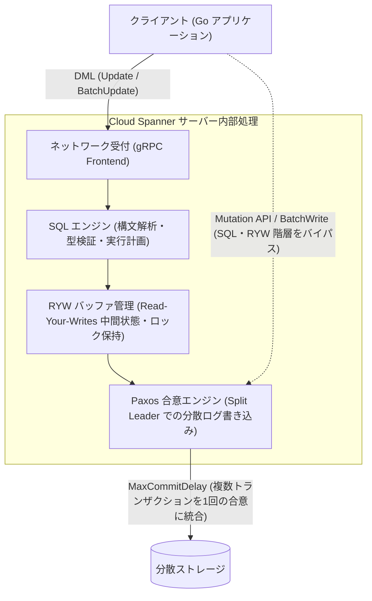
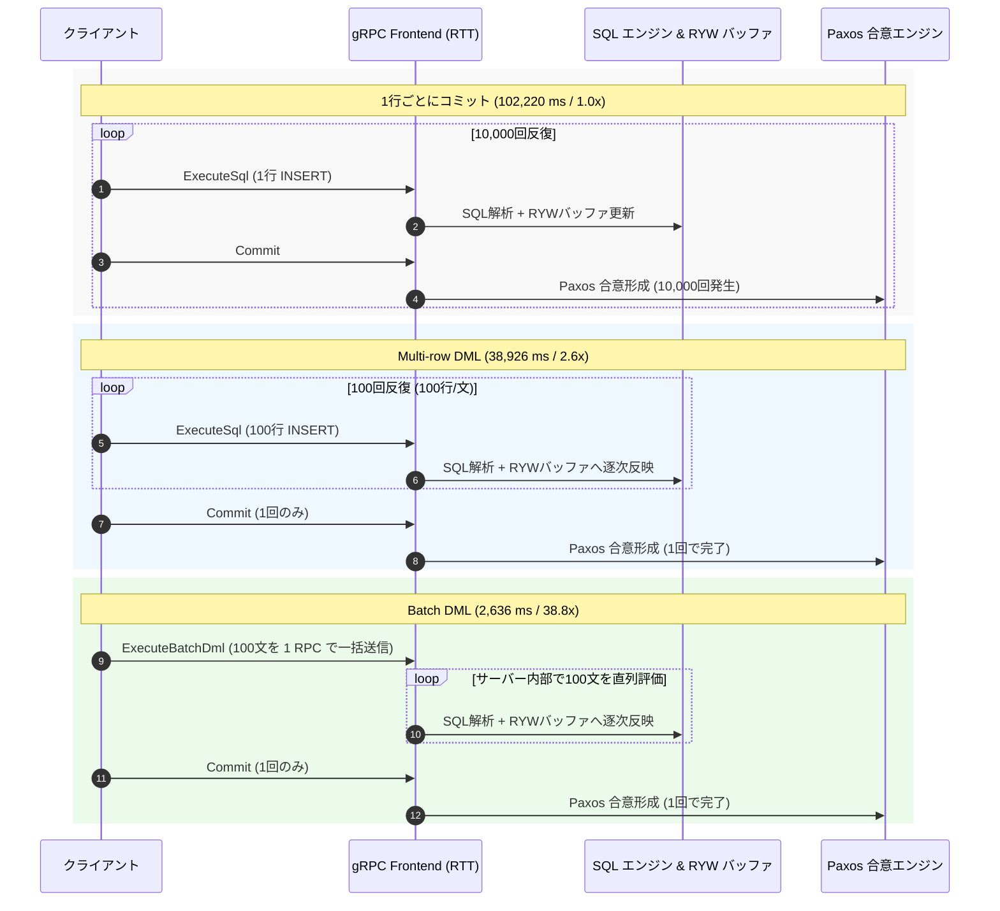
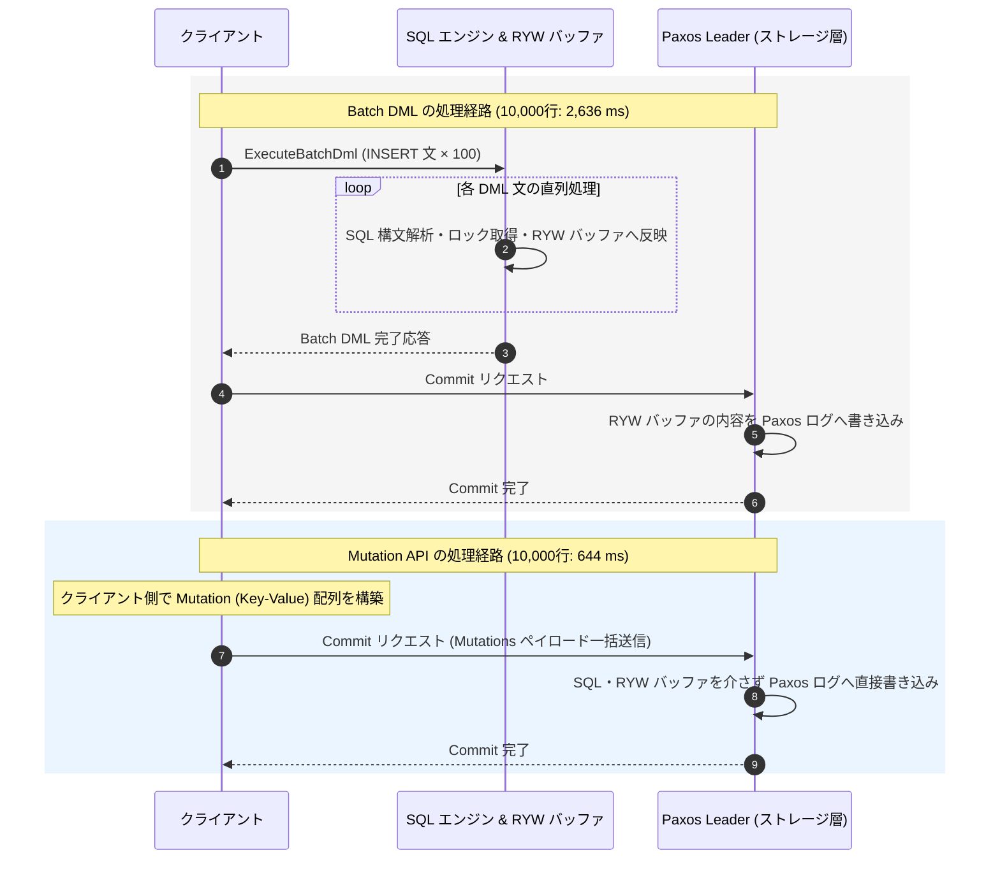
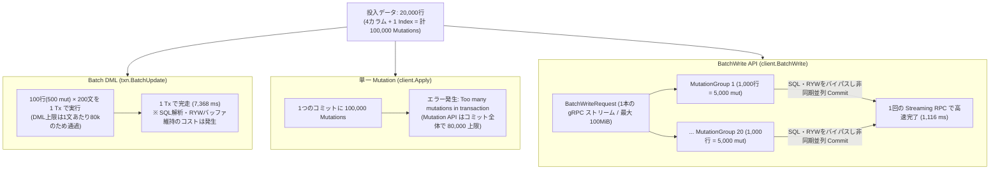
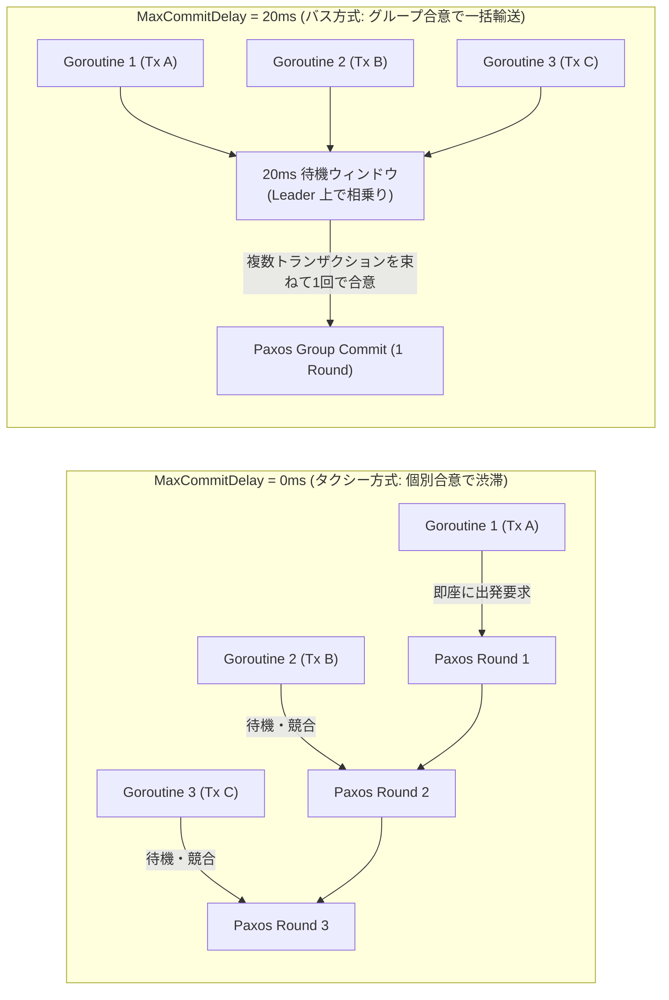
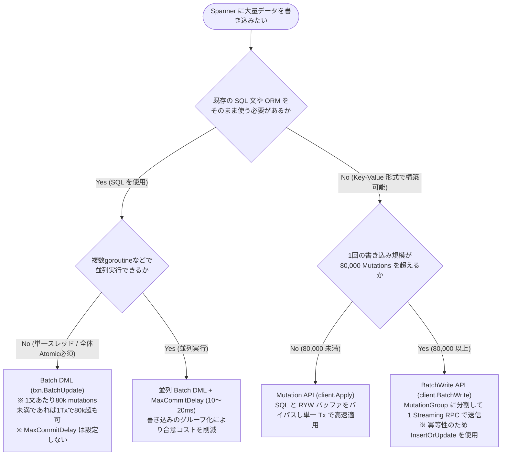

# バルク書き込みの手法比較と高速化の原理

Spanner に対して大量のデータを一括書き込みを行うとき、書き方の違いによって処理時間は大きく変化します。同じ 10,000 行のデータを書き込む処理であっても、1行ずつコミットする素朴な実装では約 102 秒を要するのに対し、Spanner の内部アーキテクチャに沿った手法を選択すれば 0.5 秒〜0.6 秒（約 150〜180 倍高速）で完了します。

本記事では、東京リージョン（`regional-asia-northeast1`）の 1000 Processing Units（1 Node）実機環境において Go SDK（`cloud.google.com/go/spanner`）で計測したベンチマーク結果をもとに、バルク書き込みを高速化する5つの手法とその内部原理を解説します。

## 10,000行の書き込みベンチマーク結果と処理階層

まず、検証対象のスキーマと実測結果の全体像を示します。検証には以下の `Players` テーブル（4カラム）とセカンダリインデックス 1 個を使用しました。

```sql
CREATE TABLE Players (
    PlayerId STRING(36) NOT NULL,
    Name     STRING(64) NOT NULL,
    Level    INT64 NOT NULL,
    Score    INT64 NOT NULL
) PRIMARY KEY (PlayerId);

CREATE INDEX PlayersByLevel ON Players (Level DESC);
```

このテーブルに 1 行を INSERT すると、テーブル本体の 4 カラム分の変更とセカンダリインデックス `PlayersByLevel` の 1 エントリ分の追加が同時に発生し、計 5 mutations（変更セル数）を必要とします。したがって、10,000 行の書き込みは 50,000 mutations に相当します。

10,000 行（50,000 mutations）を各手法で書き込んだ際の実測所要時間と、素朴な実装からの高速化倍率は以下の通りです。

| 書き込み手法 | 10,000行の所要時間 | 高速化倍率 | 削減される主なコストと内部挙動 |
| :--- | :---: | :---: | :--- |
| 1行ごとにコミットする DML (基準) | 102,220 ms (102.2秒) | 1.0 倍 | 10,000回のネットワーク往復(RTT) + 10,000回のSQL解析 + 10,000回のPaxos合意 |
| Multi-row INSERT DML (100行×100文, 1回Commit) | 38,926 ms (38.9秒) | 2.6 倍 | Paxos合意は1回に減るが、100回のRTTと10,000行分のRYWバッファ維持が残る |
| Batch DML (`txn.BatchUpdate`, 1 RPC, 1回Commit) | 2,636 ms (2.6秒) | 38.8 倍 | RTTが1回に削減されるが、SQL解析とRYWバッファ更新がサーバー内で直列実行される |
| Mutation API (`client.Apply`, 1 RPC) | 644 ms (0.64秒) | 158.7 倍 | SQLエンジンとRYWバッファを完全バイパスし、Commit時にPaxosログへ直接適用 |
| BatchWrite API (`MutationGroup`, 1 Streaming RPC) | 904 ms (0.90秒) | 113.1 倍 | 独立したグループ単位で非同期コミット。Mutation APIの80,000上限を超える規模で有効 |
| 並列 Batch DML (50並列) + `MaxCommitDelay=20ms` | 562 ms (0.56秒) | 181.9 倍 | SQLを並列実行しつつ、同時到着した複数トランザクションを1回のPaxos合意に束ねる |

※ 1行ごとにコミットする DML は 500 行を実測した平均値（10.22 ms/行）からの 10,000 行換算値であり、それ以外の手法はすべて 10,000 行を実機に書き込んだ実測値です。

### Spanner の書き込み処理が通過する階層

なぜ手法によってこれほどの差が生じるのでしょうか。Spanner にデータが書き込まれてからストレージに永続化されるまでの処理は、大きく以下の4つの階層に分解できます。

* ネットワーク受付（gRPC Frontend）：クライアントと Spanner API サーバー間の通信往復（RTT）。
* SQL エンジン（Query Engine）：SQL 文字列の構文解析、型検証、実行計画の構築。
* Read-Your-Writes（RYW）バッファ管理：同一トランザクション内の後続クエリが未コミットの変更を読み取れるようにするための中間状態の保持とインデックス更新。
* Paxos 合意エンジン（Storage / Split Leader）：データの整合性を担保するための分散合意形成と Paxos ログへの書き込み。

各書き込み手法がどの階層を通過し、どこをバイパス・効率化しているかを以下の図に示します。



以降では、最も素朴な実装から出発し、これらの階層のコストを段階的に削減していく過程をコードと図解で確認します。

---

## 一般的な SQL の高速化技法（Multi-row DML と Batch DML）

最初は、SQL（DML）を用いた書き込みです。まずは 1 行ずつトランザクションを実行する素朴な実装を確認し、そこに一般的な SQL データベースでも用いられる複数行まとめ（Multi-row INSERT）とバッチ送信（Batch DML）を適用します。

### 1行ごとにトランザクションをコミットする DML（102.2秒 / 基準 1.0倍）

最も素朴な実装は、ループの中で 1 行ごとに `ReadWriteTransaction` を開始し、`INSERT` 文を実行してコミットするコードです。

```go
// 1行ごとに ReadWriteTransaction をコミットする素朴な実装
for _, p := range players {
    _, err := client.ReadWriteTransaction(ctx, func(ctx context.Context, txn *spanner.ReadWriteTransaction) error {
        stmt := spanner.Statement{
            SQL: "INSERT INTO Players (PlayerId, Name, Level, Score) VALUES (@id, @name, @level, @score)",
            Params: map[string]interface{}{
                "id": p.PlayerId, "name": p.Name, "level": p.Level, "score": p.Score,
            },
        }
        _, err := txn.Update(ctx, stmt)
        return err
    })
    if err != nil {
        return err
    }
}
```

この実装では、1 行書き込むごとにクライアントとサーバー間の通信往復（ExecuteSql RPC と Commit RPC）が発生し、サーバー側では毎回 SQL の解析と Paxos 合意（分散ログへの書き込み）が行われます。1 行あたり約 10.22 ms を要するため、10,000 行を直列に処理すると約 102.2 秒かかります。

### Multi-row INSERT DML による1回コミット（38.9秒 / 2.6倍高速）

トランザクションの開始とコミット（Paxos 合意）の回数を減らすため、全体を 1 つの `ReadWriteTransaction` にまとめます。さらに 1 つの `INSERT` 文の `VALUES` 句に 100 行分のデータを連結（Multi-row INSERT）し、100 回 `txn.Update` を呼び出した後に 1 回だけコミットします。

```go
// 1トランザクション内で 100行ずつの INSERT 文を100回実行して 1回コミット
_, err := client.ReadWriteTransaction(ctx, func(ctx context.Context, txn *spanner.ReadWriteTransaction) error {
    chunkSize := 100
    for c := 0; c < len(players)/chunkSize; c++ {
        // VALUES ('p-000000', ...), ('p-000001', ...) のように100行を連結したSQLを構築
        sql := buildMultiRowInsertSQL(players[c*chunkSize : (c+1)*chunkSize])
        if _, err := txn.Update(ctx, spanner.Statement{SQL: sql}); err != nil {
            return err
        }
    }
    return nil
})
```

Paxos 合意（Commit）が 10,000 回から 1 回に減り、SQL の実行回数も 100 回に減ったことで、所要時間は 102.2 秒から 38.9 秒（2.6倍高速）に短縮されます。しかし、100 回の `txn.Update` を直列に呼び出しているため、クライアントとサーバー間のネットワーク往復（RTT）が 100 回発生しています。

### Batch DML による通信往復の削減（2.6秒 / 38.8倍高速）

100 回のネットワーク往復を削減するには、Spanner の Batch DML（`txn.BatchUpdate`）を使用します。構築した 100 個の Multi-row INSERT 文をスライスに格納し、1 回の RPC でまとめてサーバーへ送信します。

```go
// Batch DML (txn.BatchUpdate) により 100文を 1 RPC で送信して 1回コミット
_, err := client.ReadWriteTransaction(ctx, func(ctx context.Context, txn *spanner.ReadWriteTransaction) error {
    chunkSize := 100
    stmts := make([]spanner.Statement, 0, len(players)/chunkSize)
    for c := 0; c < len(players)/chunkSize; c++ {
        sql := buildMultiRowInsertSQL(players[c*chunkSize : (c+1)*chunkSize])
        stmts = append(stmts, spanner.Statement{SQL: sql})
    }
    // 100文の DML を 1 回の ExecuteBatchDml RPC で一括送信
    _, err := txn.BatchUpdate(ctx, stmts)
    return err
})
```

`txn.BatchUpdate` を用いることで、DML 送信のネットワーク往復が 100 回から 1 回になり、所要時間は 38.9 秒から 2.6 秒（素朴な実装比で 38.8倍高速、Multi-row DML 比でも約 14.8倍高速）へと大幅に短縮されます。

これら3つの DML 手法における通信回数とサーバー内部処理の違いを以下のシーケンス図にまとめます。



---

## SQL エンジンと RYW バッファをバイパスする Mutation API

Batch DML によってネットワーク往復と Paxos 合意回数は 1 回に削減されました。それにもかかわらず 10,000 行の処理に 2.6 秒を要しているのは、サーバー内部で「SQL エンジンによる構文解析・実行計画」と「Read-Your-Writes（RYW）バッファの維持・更新」が 10,000 行分走っているためです。

### Read-Your-Writes（RYW）バッファのオーバーヘッドとは

Spanner の `ReadWriteTransaction` 内で DML を実行すると、同一トランザクションの後続の `SELECT` クエリが「今 INSERT したばかりの未コミット行」や「更新されたセカンダリインデックス」を即座に読み取れる（Read-Your-Writes）必要があります。そのため、サーバーは DML を 1 文実行するたびにトランザクション用の中間バッファ（RYW バッファ）を構築し、テーブルデータとセカンダリインデックスの整合性をメモリ上でリアルタイムに更新し続けます。

バルク書き込みのように「データを一方的に流し込むだけで、トランザクションの途中で自分の変更を `SELECT` して読み返す必要がない（Blind Write）」場面では、この RYW バッファの維持管理は純粋なオーバーヘッドとなります。

### Mutation API による直接適用（0.64秒 / 158.7倍高速）

Spanner 特有のインターフェースである Mutation API（Go SDK では `spanner.InsertOrUpdate` 等と `client.Apply` の組み合わせ）を使用すると、SQL エンジンと RYW バッファの両方を完全にバイパスできます。

```go
// Mutation API (client.Apply) による一括コミット
cols := []string{"PlayerId", "Name", "Level", "Score"}
mutations := make([]*spanner.Mutation, len(players))
for i, p := range players {
    mutations[i] = spanner.InsertOrUpdate(
        "Players",
        cols,
        []interface{}{p.PlayerId, p.Name, p.Level, p.Score},
    )
}

// SQL エンジンおよび RYW バッファを介さず Commit 時に直接適用
_, err := client.Apply(ctx, mutations)
```

`client.Apply` は、構造化された Key-Value の変更リスト（Mutations）を `CommitRequest` のペイロードに乗せて 1 回の RPC で送信します。サーバーは SQL のパースを行わず、トランザクション途中の中間バッファも作成しないまま、Commit フェーズにおいてストレージ層（Split Leader の Paxos ログ）へ変更差分を一括適用します。

その結果、10,000 行の書き込み時間は Batch DML の 2,636 ms から 644 ms（素朴な実装比で 158.7倍高速、Batch DML 比で 4.09倍高速）へと短縮されます。Batch DML と Mutation API のサーバー内部挙動の対比を以下の図に示します。



---

## 80,000 Mutations の上限仕様と BatchWrite API

一度に書き込むデータ量がさらに増えると、Spanner の公式クォータである「80,000 mutations（およびトランザクション全体で 100 MiB）」の制限を考慮する必要があります。

Spanner における Mutation 数は「行数」ではなく、以下の計算式で算出されます。

$$\text{Mutation 数} = \text{行数} \times (\text{変更カラム数} + \text{更新対象のセカンダリインデックス数})$$

本記事の `Players` テーブル（4カラム + 1セカンダリインデックス）では 1 行あたり 5 mutations を消費するため、16,000 行で 80,000 mutations に到達します。

### インターフェースによる上限適用単位の違い：DML はステートメント単位、Mutation API はコミット単位

この 80,000 mutations の上限は、使用する書き込みインターフェースによって適用される単位が異なります（なお、いずれの方式でも 1 トランザクションあたりの合計コミットサイズ上限である 100 MiB は共通して適用されます）。

* DML（`Update` / `BatchUpdate`）の場合：
  80,000 mutations の上限はトランザクション全体の累積ではなく「1 つの DML ステートメントあたり」に適用されます。したがって、1 文あたりの変更数が 80,000 mutations 未満であれば、複数の DML 文を実行してトランザクション全体の合計が 80,000 mutations を超えても 1 つのトランザクションとしてコミットできます。
  実際に 20,000 行（100,000 mutations）を「100行（500 mutations）× 200文」の Batch DML として 1 トランザクションで実行すると、エラーになることなく 7,368 ms（約 7.4 秒）で完走します。
* Mutation API（`client.Apply`）の場合：
  80,000 mutations の上限は「1 回のコミット（トランザクション全体）に含まれる全 Mutation の合計」に対して適用されます。そのため、20,000 行（100,000 mutations）のスライスを単一の `client.Apply` に渡すと、以下の `InvalidArgument` エラーとなり実行できません。

```text
spanner: code = "InvalidArgument", desc = "The transaction contains too many mutations. Insert and update operations count with the multiplicity of the number of columns they affect. ... (Maximum number: 80000)"
```

### BatchWrite API による単一ストリームでの高速書き込み（1.12秒 / Batch DML 比 6.6倍高速）

80,000 mutations を超える大規模なデータを、SQL や RYW バッファのオーバーヘッドを伴う Batch DML（7,368 ms）ではなく、高速な Mutation 経路で 1 回の RPC として書き込みたい場合に有効なのが `BatchWrite` API（`client.BatchWrite`）です。

`BatchWrite` API は、互いに独立した複数のトランザクション変更グループ（`MutationGroup`）を 1 本の gRPC ストリーミングリクエストに束ねて送信する機能です。Mutation API の 80,000 mutations 上限は「1 つの `MutationGroup` あたり」に適用されるため、20,000 行（100,000 mutations）を 1 グループ 1,000 行（5,000 mutations）× 20 個の `MutationGroup` に分割して渡せば、1 回のストリーミング RPC（リクエスト全体の上限は 100 MiB）でエラーなく送信できます。

```go
// BatchWrite API による 20,000行 (100,000 mutations) の 1 RPC 送信
cols := []string{"PlayerId", "Name", "Level", "Score"}
chunkSize := 1000 // 1グループあたり 1,000行 = 5,000 mutations (< 80,000上限)
var groups []*spanner.MutationGroup

for g := 0; g < len(players20k)/chunkSize; g++ {
    groupMuts := make([]*spanner.Mutation, chunkSize)
    for i := 0; i < chunkSize; i++ {
        p := players20k[g*chunkSize+i]
        groupMuts[i] = spanner.InsertOrUpdate(
            "Players",
            cols,
            []interface{}{p.PlayerId, p.Name, p.Level, p.Score},
        )
    }
    groups = append(groups, &spanner.MutationGroup{Mutations: groupMuts})
}

// 20個の MutationGroup を 1本の gRPC ストリームで送信
iter := client.BatchWrite(ctx, groups)
for {
    resp, err := iter.Next()
    if err == iterator.Done {
        break
    }
    if err != nil {
        return err
    }
    // サーバー側で Commit が完了したグループから順次レスポンスが返る
    _ = resp.Indexes
}
```

20,000 行（100,000 mutations）を書き込んだ際の3手法の実測比較は以下の通りです。

* Batch DML（200文 × 100行, 1 Tx）：7,368 ms（1 文あたり 500 mutations のため完走するが、RYW バッファ維持コストがかかる）
* Mutation API（`client.Apply`, 1 Tx）：エラー（コミット全体の 80,000 mutations 上限を超過）
* BatchWrite API（20 `MutationGroup`s, 1 Streaming RPC）：1,116 ms（SQL・RYW バッファをバイパスし、Batch DML 比で 6.6 倍高速に完走）

これら3つの方式における 20,000 行（100,000 mutations）処理時の挙動の違いを以下の図に示します。



### BatchWrite API を使用する際の注意点

* アトミック性の範囲：1 つの `MutationGroup` の内部（例：親テーブル `Players` とインターリーブ子テーブル `PlayerItems` の同時更新など）はアトミックにコミットされますが、異なる `MutationGroup` 間は独立しており、一部のみがコミットされる可能性があります（トランザクション全体でのロールバックが必要な場合は Batch DML を選択します）。
* 冪等な操作（InsertOrUpdate）の指定：`BatchWrite` は Replay Protection（ネットワーク再送時の二重適用防止）をサポートしていません。通信瞬断等によるリトライ時に同一グループが再適用された場合、`spanner.Insert` を使用していると `AlreadyExists` エラーとなるため、バルク書き込みでは冪等性のある `spanner.InsertOrUpdate`（Upsert）を使用します。

---

## SQL の並列実行とスループットを最適化した書き込み（MaxCommitDelay）

ここまでの検証で、SQL を介さない Mutation API や BatchWrite API の高速性を確認しました。一方で、実際のアプリケーション開発においては「既存の ORM や SQL ビルダーの資産をそのまま流用したい」「SQL の DEFAULT 値や計算式を使って INSERT したい」といった理由から、DML を使わざるを得ないケースがあります。

### 並列 Batch DML によって生じる Paxos 合意の競合

1 つのトランザクションで 10,000 行の Batch DML を直列に実行すると 2,636 ms かかりました。これを高速化するため、10,000 行を 200 行ずつの 50 チャンクに分割し、Go の 50 個の並行goroutineから同時に Batch DML トランザクションを実行すると、所要時間は 755 ms（素朴な実装比で 135.4倍高速）まで短縮されます。

しかし、50 個のgoroutineから同一の Split Leader に対してほぼ同時に Commit 要求が殺到すると、Leader 上で Paxos 合意ラウンドが個別にスケジュールされ、合意キューの待機やレプリカ間の通信競合が発生します。

### MaxCommitDelay による書き込みのグループ化（0.56秒 / 181.9倍高速）

この並列書き込み時のレプリケーションおよび Paxos 合意コストを削減する機能が、Spanner 公式ドキュメントで「スループットを最適化した書き込み（Throughput optimized writes）」として提供されている `MaxCommitDelay` オプションです。

公式ドキュメントでは、この機能の動作について「小さな遅延を導入して同じ投票参加者（レプリカ群）へ送る書き込みのグループを収集し、まとめて実行する（executing a group of writes together）ことで計算コストを償却する」と説明されています。これは MySQL（InnoDB）などのデータベースにおける Group Commit（グループコミット）に相当する仕組みです。

この仕組みは、乗客（トランザクション）を目的地（ストレージのレプリカ群）へ運ぶ際の「タクシー方式」と「バス方式」の違いに例えると直感的に理解できます。

* タクシー方式（`MaxCommitDelay = 0ms` / デフォルト）：
  乗客が乗り場（Split Leader）に到着するたびに、1人ずつ個別のタクシー（Paxos 合意ラウンド）を発車させます。乗客が1人しかいないときは待ち時間ゼロで出発できますが、50人の乗客（50並列のgoroutine）が一斉に押し寄せると、50台のタクシーが道路や料金所に殺到して渋滞（Leader の CPU や合意キューの競合）を引き起こし、全員を運び終えるまでの総時間が長くなります。
* バス方式（`MaxCommitDelay = 20ms`）：
  乗り場に「最大 20ms ごとに出発するバス」を待機させます。最初に乗車した人は発車まで最大 20ms 待つことになりますが、その 20ms の間に駆け込んできた他の乗客を全員 1 台のバス（1回の Paxos 合意ラウンド）に乗せてまとめて出発します。車両の運行回数（レプリカ間の合意通信とログ書き込み回数）が大幅に減るため渋滞が解消され、50人全員を運び終えるまでの全体時間（スループット）は大きく短縮されます。

Go SDK で `CommitOptions` に `MaxCommitDelay`（20ms）を指定して 50 並列の Batch DML を実行するコードは以下の通りです。

```go
// 50並列の Batch DML に MaxCommitDelay (20ms) を適用して書き込みをグループ化する実装
var wg sync.WaitGroup
workers := 50
rowsPerWorker := len(players) / workers // 1ワーカーあたり200行

for w := 0; w < workers; w++ {
    wg.Add(1)
    go func(workerIdx int) {
        defer wg.Done()
        chunk := players[workerIdx*rowsPerWorker : (workerIdx+1)*rowsPerWorker]
        stmts := buildBatchDMLStatements(chunk) // 100行×2文の Batch DML

        delay := 20 * time.Millisecond
        opts := spanner.TransactionOptions{
            CommitOptions: spanner.CommitOptions{
                MaxCommitDelay: &delay,
            },
        }
        _, _ = client.ReadWriteTransactionWithOptions(ctx, func(ctx context.Context, txn *spanner.ReadWriteTransaction) error {
            _, err := txn.BatchUpdate(ctx, stmts)
            return err
        }, opts)
    }(w)
}
wg.Wait()
```

50 並列の Batch DML において `MaxCommitDelay` の有無を比較した実測結果は以下の通りです。

* 並列 Batch DML（`MaxCommitDelay = 0ms` / タクシー方式）：755.0 ms（135.4倍高速）
* 並列 Batch DML（`MaxCommitDelay = 20ms` / バス方式）：562.0 ms（181.9倍高速）

`MaxCommitDelay = 20ms` を指定することで、個別のトランザクションは最大 20ms の待機を受け入れる代わりに、50 個のトランザクションが数回の Paxos 合意ラウンドに統合され、全体の完了時間は 755 ms から 562 ms（さらに約 25.6% 短縮）へと高速化されます。この動作原理を以下の図に示します。



### 単一スレッド（直列実行）で MaxCommitDelay を設定してはいけない理由

先ほどのバス方式の例えを使うと、単一goroutineによる直列実行（前のトランザクションの Commit 完了を待ってから次のトランザクションを開始するループ）で `MaxCommitDelay` を設定してはいけない理由も明確になります。

1人ずつ順番にしか乗客が来ない状況（直列実行）でバス方式（`MaxCommitDelay = 20ms`）にすると、バスは他に相乗りする乗客が誰も来ないにもかかわらず、毎回律儀に 20ms 扉を開けて発車を待ち続けます。実際に 50 トランザクション（各200行）を 1 goroutineで直列実行した際の実測比較は以下の通りです。

* 直列 Batch DML（50 Txns, `MaxCommitDelay = 0ms`）：2,481.0 ms
* 直列 Batch DML（50 Txns, `MaxCommitDelay = 20ms`）：4,041.0 ms（+1,560 ms の遅延増加）

直列実行では、設定した遅延時間が毎回のコミットに純粋な待ち時間として加算され、処理時間が約 1.63 倍に悪化します。`MaxCommitDelay` は必ず複数ワーカーからの並列書き込み時にのみ指定します。

また、公式ドキュメントに記載されている通り、Spanner はデフォルト（`MaxCommitDelay` 未指定）であっても、書き込みの急増（spiky workload）を検知すると自動的に小さな遅延を入れて書き込みをグループ化する機能を備えています。Mutation API（`client.Apply`）を高並列で実行する場合は、この内部の自動バッチング機能がデフォルトの状態で十分に働くため、手動で `MaxCommitDelay` を設定しなくても高いスループットが得られます。

---

## まとめとバルク書き込み手法の選定フローチャート

本記事で解説したバルク書き込み手法の特性と、1000 PU 実機環境における 10,000 行（50,000 mutations）および 20,000 行（100,000 mutations）の性能比較一覧を以下にまとめます。

| 書き込み手法 | 10,000行 (50k mut) | 20,000行 (100k mut) | SQL/ORM 流用 | トランザクション原子性 | 適したユースケース |
| :--- | :---: | :---: | :---: | :---: | :--- |
| 1行ごと DML Commit | 102,220 ms (1.0x) | 約 204 秒 | 可 | 1行単位 | バッチ・テスト投入では非推奨 |
| Multi-row DML | 38,926 ms (2.6x) | 約 78 秒 | 可 | 全体で Atomic | 簡易な SQL 実行 |
| Batch DML (`BatchUpdate`) | 2,636 ms (38.8x) | 7,368 ms (1 Tx完走) | 可 | 全体で Atomic | SQL を使いつつ全体を1トランザクションにしたい場合 |
| Mutation API (`client.Apply`) | 644 ms (158.7x) | エラー (80k上限超過) | 不可 (Key-Value) | 全体で Atomic | 8万 mutations 未満の高速一括投入 |
| BatchWrite API (`MutationGroup`) | 904 ms (113.1x) | 1,116 ms (1 RPC完走) | 不可 (Key-Value) | グループ単位 | 8万 mutations を超える大規模データの高速投入 |
| 並列 Batch DML + `MaxCommitDelay=20ms` | 562 ms (181.9x) | 並列数に応じ高速完走 | 可 | ワーカー単位 | 既存 SQL/ORM 資産を並列化して高速投入する場合 |

### 要件に応じた手法選定フローチャート

開発現場で Spanner へのバルク書き込みを実装する際は、以下のフローチャートに沿って手法を選定できます。



### 補足：バルク削除（クリーンアップ）における Mutation の優位性

データの投入だけでなく、テストケース間などでテーブル内の全データを削除（クリーンアップ）する際にも DML と Mutation の内部動作の違いが現れます。

DML で `DELETE FROM Players WHERE true` を実行すると、サーバー内部で既存行のテーブルスキャンと個別ロック獲得が発生します。一方、Mutation API で `spanner.Delete("Players", spanner.AllKeys())` を実行すると、行のスキャンを一切行わず、ストレージエンジンに対してキー空間全体（`[-∞, +∞]`）に対する削除マーカー（Range Tombstone）を 1 つ書き込むだけで即座に完了します。さらに子テーブルが `INTERLEAVE IN PARENT Players ON DELETE CASCADE` で定義されていれば、親テーブルへの `AllKeys()` 削除 1 回で子テーブルとセカンダリインデックスも含めて 10ms 未満で初期化できます。

---

## 付録：実機ベンチマーク測定コード全文（Go）

本記事の実測値を再現するための Go ベンチマークコード（`cloud.google.com/go/spanner` v1.95.1）の全文は以下の通りです。

```go
package main

import (
	"context"
	"fmt"
	"log"
	"os"
	"strings"
	"sync"
	"time"

	"cloud.google.com/go/spanner"
	"google.golang.org/api/iterator"
)

const (
	totalRows      = 10000
	largeTotalRows = 20000 // 20,000 rows * 5 mutations/row = 100,000 mutations (> 80,000 limit)
	sampleNaive    = 500   // 1行ごとコミットの計測サンプル数
)

type Player struct {
	PlayerId string
	Name     string
	Level    int64
	Score    int64
}

func generatePlayers(n int) []Player {
	players := make([]Player, n)
	for i := 0; i < n; i++ {
		players[i] = Player{
			PlayerId: fmt.Sprintf("p-%06d", i),
			Name:     fmt.Sprintf("Player_%d", i),
			Level:    int64(i % 100),
			Score:    int64(i * 10),
		}
	}
	return players
}

func clearTable(ctx context.Context, client *spanner.Client) error {
	_, err := client.Apply(ctx, []*spanner.Mutation{
		spanner.Delete("Players", spanner.AllKeys()),
	})
	return err
}

func main() {
	dbPath := os.Getenv("SPANNER_DATABASE")
	if dbPath == "" {
		log.Fatal("SPANNER_DATABASE environment variable is required (e.g. projects/my-proj/instances/my-inst/databases/my-db)")
	}

	ctx := context.Background()
	client, err := spanner.NewClient(ctx, dbPath)
	if err != nil {
		log.Fatalf("Failed to create client: %v", err)
	}
	defer client.Close()

	players10k := generatePlayers(totalRows)
	players20k := generatePlayers(largeTotalRows)

	_ = clearTable(ctx, client)

	// 1行ごとにコミットする素朴な DML
	fmt.Println("Naive DML (1 row per ReadWriteTransaction commit)...")
	_ = clearTable(ctx, client)
	t0 := time.Now()
	for i := 0; i < sampleNaive; i++ {
		p := players10k[i]
		_, err := client.ReadWriteTransaction(ctx, func(ctx context.Context, txn *spanner.ReadWriteTransaction) error {
			stmt := spanner.Statement{
				SQL: "INSERT INTO Players (PlayerId, Name, Level, Score) VALUES (@id, @name, @level, @score)",
				Params: map[string]interface{}{
					"id": p.PlayerId, "name": p.Name, "level": p.Level, "score": p.Score,
				},
			}
			_, err := txn.Update(ctx, stmt)
			return err
		})
		if err != nil {
			log.Fatalf("Naive DML failed: %v", err)
		}
	}
	perRowMs := float64(time.Since(t0).Milliseconds()) / float64(sampleNaive)
	estNaive10kMs := perRowMs * float64(totalRows)
	fmt.Printf("    -> 10,000 rows extrapolated: %.1f ms (%.2f ms/row)\n", estNaive10kMs, perRowMs)

	// Multi-row INSERT DML (100 rows/stmt x 100 RPCs in 1 Tx)
	fmt.Println("Multi-row INSERT DML (100 rows/stmt x 100 RPCs in 1 Tx)...")
	_ = clearTable(ctx, client)
	t0 = time.Now()
	_, err = client.ReadWriteTransaction(ctx, func(ctx context.Context, txn *spanner.ReadWriteTransaction) error {
		chunkSize := 100
		for c := 0; c < totalRows/chunkSize; c++ {
			var sb strings.Builder
			sb.WriteString("INSERT INTO Players (PlayerId, Name, Level, Score) VALUES ")
			for r := 0; r < chunkSize; r++ {
				p := players10k[c*chunkSize+r]
				if r > 0 {
					sb.WriteString(", ")
				}
				sb.WriteString(fmt.Sprintf("('%s', '%s', %d, %d)", p.PlayerId, p.Name, p.Level, p.Score))
			}
			if _, err := txn.Update(ctx, spanner.Statement{SQL: sb.String()}); err != nil {
				return err
			}
		}
		return nil
	})
	if err != nil {
		log.Fatalf("Multi-row DML failed: %v", err)
	}
	fmt.Printf("    -> 10,000 rows completed in: %d ms\n", time.Since(t0).Milliseconds())

	// Batch DML (txn.BatchUpdate: 100 statements in 1 RPC, 1 Tx)
	fmt.Println("Batch DML (txn.BatchUpdate: 100 statements in 1 RPC, 1 Tx)...")
	_ = clearTable(ctx, client)
	t0 = time.Now()
	_, err = client.ReadWriteTransaction(ctx, func(ctx context.Context, txn *spanner.ReadWriteTransaction) error {
		chunkSize := 100
		stmts := make([]spanner.Statement, 0, totalRows/chunkSize)
		for c := 0; c < totalRows/chunkSize; c++ {
			var sb strings.Builder
			sb.WriteString("INSERT INTO Players (PlayerId, Name, Level, Score) VALUES ")
			for r := 0; r < chunkSize; r++ {
				p := players10k[c*chunkSize+r]
				if r > 0 {
					sb.WriteString(", ")
				}
				sb.WriteString(fmt.Sprintf("('%s', '%s', %d, %d)", p.PlayerId, p.Name, p.Level, p.Score))
			}
			stmts = append(stmts, spanner.Statement{SQL: sb.String()})
		}
		_, err := txn.BatchUpdate(ctx, stmts)
		return err
	})
	if err != nil {
		log.Fatalf("Batch DML failed: %v", err)
	}
	fmt.Printf("    -> 10,000 rows completed in: %d ms\n", time.Since(t0).Milliseconds())

	// Mutation API (client.Apply: 10,000 rows = 50,000 mutations in 1 RPC)
	fmt.Println("Mutation API (client.Apply: 10,000 rows in 1 RPC)...")
	_ = clearTable(ctx, client)
	cols := []string{"PlayerId", "Name", "Level", "Score"}
	muts10k := make([]*spanner.Mutation, totalRows)
	for i, p := range players10k {
		muts10k[i] = spanner.InsertOrUpdate("Players", cols, []interface{}{p.PlayerId, p.Name, p.Level, p.Score})
	}
	t0 = time.Now()
	if _, err := client.Apply(ctx, muts10k); err != nil {
		log.Fatalf("Mutation Apply failed: %v", err)
	}
	fmt.Printf("    -> 10,000 rows completed in: %d ms\n", time.Since(t0).Milliseconds())

	// 20,000 rows (100,000 mutations) 比較: Batch DML vs Mutation Apply vs BatchWrite
	fmt.Println("20,000 rows (100,000 mutations) Comparison...")
	_ = clearTable(ctx, client)
	t0 = time.Now()
	_, err = client.ReadWriteTransaction(ctx, func(ctx context.Context, txn *spanner.ReadWriteTransaction) error {
		chunkSize := 100
		stmts := make([]spanner.Statement, 0, largeTotalRows/chunkSize)
		for c := 0; c < largeTotalRows/chunkSize; c++ {
			var sb strings.Builder
			sb.WriteString("INSERT INTO Players (PlayerId, Name, Level, Score) VALUES ")
			for r := 0; r < chunkSize; r++ {
				p := players20k[c*chunkSize+r]
				if r > 0 {
					sb.WriteString(", ")
				}
				sb.WriteString(fmt.Sprintf("('%s', '%s', %d, %d)", p.PlayerId, p.Name, p.Level, p.Score))
			}
			stmts = append(stmts, spanner.Statement{SQL: sb.String()})
		}
		_, err := txn.BatchUpdate(ctx, stmts)
		return err
	})
	fmt.Printf("    -> Batch DML (200 stmts x 100 rows in 1 Tx): err=%v, elapsed=%d ms\n", err, time.Since(t0).Milliseconds())

	_ = clearTable(ctx, client)
	muts20k := make([]*spanner.Mutation, largeTotalRows)
	for i, p := range players20k {
		muts20k[i] = spanner.InsertOrUpdate("Players", cols, []interface{}{p.PlayerId, p.Name, p.Level, p.Score})
	}
	_, err = client.Apply(ctx, muts20k)
	fmt.Printf("    -> Single Apply (100,000 mutations in 1 Commit): expected error -> %v\n", err)

	_ = clearTable(ctx, client)
	mgs20k := make([]*spanner.MutationGroup, 20)
	for g := 0; g < 20; g++ {
		groupMuts := make([]*spanner.Mutation, 1000)
		for i := 0; i < 1000; i++ {
			p := players20k[g*1000+i]
			groupMuts[i] = spanner.InsertOrUpdate("Players", cols, []interface{}{p.PlayerId, p.Name, p.Level, p.Score})
		}
		mgs20k[g] = &spanner.MutationGroup{Mutations: groupMuts}
	}
	t0 = time.Now()
	iter20k := client.BatchWrite(ctx, mgs20k)
	for {
		_, err := iter20k.Next()
		if err == iterator.Done {
			break
		}
		if err != nil {
			log.Fatalf("BatchWrite 20k failed: %v", err)
		}
	}
	fmt.Printf("    -> BatchWrite (20 groups in 1 Streaming RPC): completed in %d ms\n", time.Since(t0).Milliseconds())

	// Parallel Batch DML + MaxCommitDelay (50 workers x 200 rows = 10,000 rows)
	fmt.Println("Parallel Batch DML (50 concurrent workers x 200 rows = 10,000 rows)...")
	for _, d := range []time.Duration{0, 20 * time.Millisecond} {
		_ = clearTable(ctx, client)
		tStart := time.Now()
		var wg sync.WaitGroup
		workers := 50
		rowsPerWorker := totalRows / workers
		for w := 0; w < workers; w++ {
			wg.Add(1)
			go func(workerIdx int) {
				defer wg.Done()
				stmts := make([]spanner.Statement, 2)
				for s := 0; s < 2; s++ {
					var sb strings.Builder
					sb.WriteString("INSERT INTO Players (PlayerId, Name, Level, Score) VALUES ")
					base := workerIdx*rowsPerWorker + s*100
					for r := 0; r < 100; r++ {
						p := players10k[base+r]
						if r > 0 {
							sb.WriteString(", ")
						}
						sb.WriteString(fmt.Sprintf("('%s', '%s', %d, %d)", p.PlayerId, p.Name, p.Level, p.Score))
					}
					stmts[s] = spanner.Statement{SQL: sb.String()}
				}
				opts := spanner.TransactionOptions{}
				if d > 0 {
					opts.CommitOptions = spanner.CommitOptions{MaxCommitDelay: &d}
				}
				_, _ = client.ReadWriteTransactionWithOptions(ctx, func(ctx context.Context, txn *spanner.ReadWriteTransaction) error {
					_, err := txn.BatchUpdate(ctx, stmts)
					return err
				}, opts)
			}(w)
		}
		wg.Wait()
		fmt.Printf("    -> MaxCommitDelay=%v: %d ms\n", d, time.Since(tStart).Milliseconds())
	}
}
```
