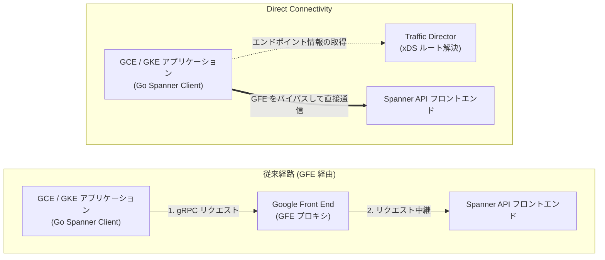

## tl;dr

- Spannerへのアクセスのレイテンシーを短くするための新機能が提供開始されました。
- 2026年9月時点で対応している言語は Go と Java です。
- メモリの使用量が若干増えるのでご注意ください。

## はじめに

Spanner は分散データベースという特性上、多くのコンポーネントで構成されています。そのため、一般的な RDB に比べると単純な処理を行ったときでもレイテンシーが高くなる傾向にありました。

レイテンシーの原因の一部は Spanner へのアクセスが **Google Front End（GFE）** を経由することに由来します。これに対し、GFE をバイパスしてクライアント VM から Spanner の API フロントエンドへ直接 gRPC 通信を行う機能が [**Direct Connectivity**](https://docs.cloud.google.com/spanner/docs/latency-points#direct_connectivity) です。

この記事では、Direct Connectivity によって通信経路がどのように変化するかを仕組みを説明し、東京リージョンの Spanner インスタンス と Go SDK（`cloud.google.com/go/spanner` v1.95.1）を用いてレイテンシーの変化（度数分布ヒストグラムやパーセンタイル比較）の測定結果を紹介します。利用する上での留意点である「クライアントのメモリ消費量の増加」がなぜ起きるのかを、Go ドライバーの実装コードと測定結果から確認します。

> **※注記**：本記事に掲載しているレイテンシーやメモリ消費量の測定値は、あくまで手元の検証環境で試行した際の**参考情報**であり、実際の環境やワークロードによって数値は異なります。

---

## この機能の仕組み：従来経路（GFE 経由）と Direct Connectivity の違い

従来の経路（GFE 経由）と Direct Connectivity の違いは、**「プロキシ（GFE）のバイパス」** と **「ルーティング解決（コントロールプレーン）のクライアントサイドへの移行」** の 2 点にあります。

### 1. GFE のバイパスによる通信経路の短縮

従来の経路では、クライアントが `spanner.googleapis.com:443` に対して接続すると、通信はまず Google Front End（GFE）に到達します。GFE はリクエストを受け取った後、対象データベースが配置されているリージョンの Spanner API フロントエンドへリクエストを中継していました。この構成では、GFE でのプロキシ処理によるオーバーヘッドが毎回の RPC に加算されるほか、GFE 層の混雑状況やコネクション再確立に起因するテールレイテンシー（p99〜p99.9）のばらつきが発生する場合がありました。

一方、Direct Connectivity を有効にすると、GCE / GKE 上のクライアントは Google Cloud の内部ネットワークを介して、Spanner API フロントエンドのエンドポイント（IPv4 `34.126.0.0/18` または IPv6 `2001:4860:8040::/42`）へ **GFE を経由せずに直接 gRPC 通信** を行います。

両者の通信経路の違いを以下の図に示します。



### 2. クライアントサイドでのルート解決と `dp_check` による事前確認

GFE をバイパスする場合、「どのエンドポイント（IP アドレス）にリクエストを送るべきか」をクライアント自身が解決する必要があります。Direct Connectivity では、Google Cloud の **Traffic Director（xDS プロトコル）** から接続先のエンドポイントリストやルーティング情報を受け取ることで、クライアント側の gRPC ライブラリが適切な Spanner API フロントエンドへ直接リクエストを振り分ける仕組みになっています。

稼働中の GCE VM や GKE Pod のネットワーク環境（VPC ルート、ファイアウォール、サービスアカウント権限など）において Direct Connectivity が利用可能かどうかは、Google Cloud が公開している診断ツール **`dp_check`**（[`GoogleCloudPlatform/grpc-gcp-tools`](https://github.com/GoogleCloudPlatform/grpc-gcp-tools)）を実行することで事前に判別できます。

```bash
# GCE VM / GKE Pod 上での Direct Connectivity 疎通確認コマンド
curl -sL https://github.com/GoogleCloudPlatform/grpc-gcp-tools/releases/latest/download/dp_check -o dp_check
chmod +x dp_check
./dp_check --service=spanner.googleapis.com
```

実行環境が要件を満たしていれば、以下のように Traffic Director からのエンドポイント取得およびバックエンドへの直接接続テストが `PASSED` となったことが出力されます。

```text
Running on GCP: PASSED
IPv4 address allocated to VM's primary NIC: PASSED
Xds bootstrap environment variable: PASSED
...
Secure connectivity to IPv4 backends from Traffic Director: PASSED
```

---

## 実測検証

Direct Connectivity の効果を確認するため、東京リージョンの **1,000 Processing Units（1 Node）** インスタンスに対してベンチマークを実施しました。

### 測定環境とワークロード仕様

* **クライアント環境**：Compute Engine `n4-standard-2`（2 vCPU, 8 GB RAM, 東京 `asia-northeast1-b`）
* **Spanner 環境**：`regional-asia-northeast1` 構成、**1,000 Processing Units（1 Node）**
* **ソフトウェア**：Go 1.26.0、`cloud.google.com/go/spanner` v1.95.1、`google.golang.org/grpc` v1.82.1
* **対象テーブル**：主キー `id INT64` と `name STRING(MAX)` のみを持つシンプルな `PoC_Users` テーブル（セカンダリインデックスなし、100行投入済み）
* **比較条件**：
  1. **GFE 経由（従来経路）**：`GOOGLE_SPANNER_ENABLE_DIRECT_ACCESS=false`
  2. **Direct Connectivity**：`GOOGLE_SPANNER_ENABLE_DIRECT_ACCESS=true`
* **測定ワークロード**：
  * **Point Read (`Concurrency = 1`, 3,000 samples)**：実運用において単一行の参照（Point Read）を行う際は、高速に読み取るため Stale Read を用いるのが一般的です。そこで本計測では `client.Single().WithTimestampBound(spanner.ExactStaleness(15 * time.Second)).ReadRow` による 1 行読み取り（1 リクエスト＝**1 RPC 往復**）を実施しました。
  * **Point Read (`Concurrency = 4`, 4,000 samples)**：4 ゴルーチンから同時に Stale Read（`ExactStaleness=15s`）を実行（デフォルトの 4 本の gRPC チャネルを並行利用）。
  * **Read-Write Transaction DML (`Concurrency = 1`, 1,000 samples)**：`client.ReadWriteTransaction` 内で `UPDATE PoC_Users SET name = @name WHERE id = @id` を実行。Go SDK の `InlineBegin` 最適化により、トランザクション開始は最初の `ExecuteSql` に含まれるため、1 トランザクション＝**2 RPC 往復（`ExecuteSql` + `Commit`）** となります。

### 実測結果サマリ

計測によって得られたレイテンシー統計値（単位：ミリ秒）を以下の表に示します。

| ワークロード | 接続経路 | Mean (平均) | StdDev (標準偏差) | Min (最小) | p50 (中央値) | p90 | p95 | p99 | p99.9 |
| :--- | :--- | :---: | :---: | :---: | :---: | :---: | :---: | :---: | :---: |
| **Point Read (c=1)**<br>*(Stale Read 15s, 1 RPC)* | GFE 経由 (従来) | 2.88 ms | 0.80 ms | 1.70 ms | **2.68 ms** | 3.73 ms | 4.12 ms | **5.99 ms** | 8.33 ms |
| | **Direct Connectivity** | **2.06 ms** | **0.79 ms** | **0.98 ms** | **1.84 ms** | **2.96 ms** | **3.16 ms** | **3.68 ms** | **5.13 ms** |
| | *短縮効果 (差分 / 割合)* | *-0.82 ms (-28%)* | *-0.01 ms* | ***-0.72 ms (-42%)*** | ***-0.83 ms (-31%)*** | *-0.77 ms (-21%)* | *-0.96 ms (-23%)* | ***-2.31 ms (-39%)*** | ***-3.20 ms (-38%)*** |
| **Point Read (c=4)**<br>*(Stale Read 15s, 4 Ch)* | GFE 経由 (従来) | 2.93 ms | 1.20 ms | 1.47 ms | **2.56 ms** | 4.41 ms | 5.29 ms | **7.54 ms** | 10.39 ms |
| | **Direct Connectivity** | **1.84 ms** | **0.69 ms** | **0.80 ms** | **1.64 ms** | **2.78 ms** | **3.04 ms** | **3.85 ms** | **5.43 ms** |
| | *短縮効果 (差分 / 割合)* | *-1.09 ms (-37%)* | *-0.51 ms (-43%)* | ***-0.67 ms (-46%)*** | ***-0.92 ms (-36%)*** | *-1.63 ms (-37%)* | *-2.25 ms (-43%)* | ***-3.69 ms (-49%)*** | ***-4.96 ms (-48%)*** |
| **Read-Write Txn (c=1)**<br>*(2 RPCs: Update+Commit)* | GFE 経由 (従来) | 8.15 ms | 1.29 ms | 6.04 ms | **8.14 ms** | 9.42 ms | 9.80 ms | **13.36 ms** | 17.16 ms |
| | **Direct Connectivity** | **7.84 ms** | 1.34 ms | **5.86 ms** | **7.52 ms** | **9.33 ms** | 10.19 ms | **11.95 ms** | 17.70 ms |
| | *短縮効果 (差分 / 割合)* | *-0.31 ms (-4%)* | *+0.05 ms* | *-0.18 ms* | ***-0.62 ms (-8%)*** | *-0.09 ms* | *+0.39 ms* | ***-1.41 ms (-11%)*** | *+0.54 ms* |

### 結果の比較

測定した 3 つのパターン（① Point Read 1並列 / ② Point Read 4並列 / ③ Read-Write トランザクション 1並列）について、レイテンシーごとのリクエスト件数を表す**度数分布（ヒストグラム）**と、中央値や上位 1% の遅延（テールレイテンシー）を表す**主要パーセンタイル（p50 / p90 / p99）の棒グラフ**をそれぞれ横並びで示します。

#### 1. 度数分布（ヒストグラム）の比較（全 3 パターン）


* **① Point Read (1並列 / c=1)**：Direct Connectivity（青）を有効にすることで、GFE 経由（グレー）に比べて分布全体が左（低レイテンシー側）へ約 0.8〜0.9 ms シフトしています。中央値（p50）は `2.68 ms` から **`1.84 ms`（-31.1%）** に短縮され、最小値は **`0.98 ms`（1 ミリ秒未満）** となりました。
* **② Point Read (4並列 / c=4)**：4 本の gRPC チャネルを並行利用する 4 並列条件でも同様に分布が左へシフトしており、中央値（p50）は `2.56 ms` から **`1.64 ms`（-36.0%）**、最小値は **`0.80 ms`** となっています。
* **③ Read-Write トランザクション (1並列 / c=1)**：`ExecuteSql`（DML）と `Commit` の 2 回の RPC 往復を行うトランザクションにおいても、緑色の分布（Direct Connectivity）がグレー（GFE 経由）より左へ寄っており、中央値（p50）で `8.14 ms` から **`7.52 ms`（-0.62 ms / -7.6%）** に短縮されています。

#### 2. 主要パーセンタイル（p50 / p90 / p99）の比較（全 3 パターン）


各パネルの右側に黄色破線枠で強調している **p99（上位 1% の遅延＝テールレイテンシー）** に注目すると、Direct Connectivity によってプロキシ経由で発生していた遅延の跳ね上がりが大幅に抑えられていることがわかります。

* **① Point Read (1並列)**：p50（中央値）が `2.68 ms → 1.84 ms`（**-31.1%**）に短縮されているだけでなく、**p99（上位1%の遅延）** は `5.99 ms → 3.68 ms`（**-38.6%**）と約 2.3 ms 短縮されています。
* **② Point Read (4並列)**：4 並列条件では GFE 経由の p99 が `7.54 ms` まで広がっていたのに対し、Direct Connectivity では **`3.85 ms`（-49.0% / 約半減）** に抑えられており、複数チャネル並行通信時におけるテールレイテンシー抑制効果が表れています。
* **③ Read-Write トランザクション (1並列 / c=1)**：2 回の RPC 往復を伴う書き込みトランザクションでも、p50 が `8.14 ms → 7.52 ms`（**-7.6%**）、**p99** が `13.36 ms → 11.95 ms`（**-10.6% / -1.41 ms**）と、プロキシバイパスによる通信時間の削減がそのままトランザクション応答時間の改善に寄与しています。

---

## 利用する上での留意点：クライアントのメモリ消費量について

Direct Connectivity を有効にすると、クライアント側でエンドポイント情報の管理やフォールバック用の通信経路を保持するため、メモリ消費量がわずかに増加します。ここでは Go SDK（`cloud.google.com/go/spanner` v1.95.1）の実装コードと、手元の検証環境で測定した参考値から、メモリ消費が増加する仕組みを確認します。

### コードレベルで読み取れるメモリ増加の仕組み

#### 1. フォールバック用コネクションプールの保持

主要なメモリ使用量増加の要因は、Direct Connectivity の経路に万が一問題が生じた際、リクエストを失敗させずに従来の GFE 経由へ即座に切り替えられるよう、クライアント内部でフォールバック用のコネクションプールもあわせて保持する実装になっていることです。

実際に Go SDK（`cloud.google.com/go/spanner` **v1.95.1**）の [`spanner/client.go` 内の `createFallbackConnPool` 関数（L596-L645）](https://github.com/googleapis/google-cloud-go/blob/spanner/v1.95.1/spanner/client.go#L596-L645) を確認すると、以下のように実装されています。

```go
// 参照元: https://github.com/googleapis/google-cloud-go/blob/spanner/v1.95.1/spanner/client.go#L596-L645
// パッケージ・バージョン: cloud.google.com/go/spanner v1.95.1
func createFallbackConnPool(
	ctx context.Context,
	config ClientConfig,
	hasNumChannelsConfig bool,
	metricsTracerFactory *builtinMetricsTracerFactory,
	opts ...option.ClientOption,
) (gtransport.ConnPool, []option.ClientOption, error) {
	...
	allOpts := allClientOpts(config.NumChannels, config.Compression, config.EnableDirectAccess, opts...)
	// 1. Direct Connectivity 用のプライマリコネクションプールを作成 (デフォルト 4 チャネル)
	primaryConn, err := gtransport.DialPool(ctx, allOpts...)
	if err != nil {
		return nil, nil, err
	}

	// 2. 通信障害時に即座に GFE 経由へ退避するためのフォールバックプールを作成 (4 チャネル)
	fallbackConnOpts := append(allOpts, internaloption.EnableDirectPath(false))
	fallbackConn, err := gtransport.DialPool(ctx, fallbackConnOpts...)
	if err != nil {
		primaryConn.Close()
		return nil, nil, err
	}
	...
	// 3. 2 つのプールをラップし、エラー発生時の自動フォールバックを構成
	gcpFallback, err := grpcgcp.NewGCPFallback(ctx, primaryConn, fallbackConn, fbOpts)
	...
	return &fallbackWrapper{gcpFallback, primaryConn, fallbackConn}, allOpts, nil
}
```

Spanner Go クライアントはデフォルトで `NumChannels = 4` 本の gRPC チャネルを作成します。Direct Connectivity 有効時は、`primaryConn`（直接通信用の 4 チャネル）に加えて、退避用の `fallbackConn`（GFE 経由の 4 チャネル）が同時に初期化・維持されるため、1 つの `spanner.Client` インスタンス内で保持されるチャネル構造体が 2 倍（計 8 チャネル分）になります。

#### 2. エンドポイント管理（xDS）と Go ランタイムのヒープ予約（`HeapSys`）

フォールバックプールの保持に加え、従来 GFE 側で行っていた接続先エンドポイントリストの管理やヘルスチェック（xDS クライアントおよびルートキャッシュ）をクライアントプロセスのメモリ上で処理するため、生存ヒープ（`HeapAlloc`）が数 MB 増加します。また、これに伴い通信やヘルスチェックを管理するバックグラウンドのゴルーチンも追加で動作します（ただし、一般的な Web アプリケーション等では元々多くのゴルーチンが動作するため、Direct Connectivity に関連するゴルーチンの増加分はアプリケーション全体から見れば相対的にわずかです）。

そのため、xDS キャッシュやフォールバックプールによって生存ヒープ（`HeapAlloc`）が約 3.4 MB 増加すると、Go ランタイムが OS から確保する物理メモリ（`VmRSS`：Resident Set Size）としてはその約 2 倍にあたる **約 7.5〜9.2 MB の増加** となって現れます。

### 実機でのメモリ消費量計測結果

GCE VM（`bastion`）上で `spanner.Client` インスタンスを 1 個作成した場合と、複数のデータベースへ接続するケースを想定して 5 個作成した場合のそれぞれについて、Warmup 完了後に `runtime.GC()` を実行した状態（Post-GC）のメモリ統計（`runtime.ReadMemStats` および Linux `/proc/self/status` の `VmRSS`）を計測しました。


実測された各メトリクスの数値を以下の表に示します。

| クライアント数 | 接続経路 | Goroutines<br>(`NumGoroutine`) | HeapAlloc<br>*(生存ヒープ)* | HeapInuse<br>*(使用中スパン)* | HeapSys<br>*(GC Target / 予約済)* | VmRSS (Post-GC)<br>*(OS 実メモリ消費)* | VmRSS (Pre-GC)<br>*(GC 前ピーク RSS)* |
| :--- | :--- | :---: | :---: | :---: | :---: | :---: | :---: |
| **0 (Baseline)** | 起動直後・接続前 | 6 | 2.63 MB | 4.49 MB | 11.66 MB | 31.49 MB | — |
| **1 Client**<br>*(標準構成)* | GFE 経由 (従来) | 37 | 3.19 MB | 5.05 MB | 11.53 MB | 32.23 MB | 33.45 MB |
| | **Direct Connectivity** | **177** | **6.63 MB** | **10.38 MB** | **18.97 MB** | **39.77 MB** | **42.64 MB** |
| | *1 Client あたりの増分* | ***+140 goroutines*** | ***+3.44 MB*** | ***+5.33 MB*** | ***+7.44 MB*** | ***+7.54 MB*** | ***+9.19 MB*** |
| **5 Clients**<br>*(複数 DB 接続)* | GFE 経由 (従来) | 161 | 5.04 MB | 7.75 MB | 15.13 MB | 35.17 MB | 37.67 MB |
| | **Direct Connectivity** | **769** | **14.15 MB** | **21.38 MB** | **36.84 MB** | **52.43 MB** | **60.06 MB** |
| | *5 Clients 合計の増分* | *+608 goroutines* | *+9.11 MB* | *+13.63 MB* | *+21.71 MB* | *+17.26 MB* | *+22.39 MB* |
| | *1 Client あたりの平均増分* | ***+121.6 / client*** | ***+1.82 MB / client*** | ***+2.73 MB / client*** | ***+4.34 MB / client*** | ***+3.45 MB / client*** | ***+4.48 MB / client*** |

### メモリ分析から得られる運用上の指針

1. 1 クライアントあたりの実メモリ（RSS）増分は約 7.5〜9.2 MB
   単一の `spanner.Client` を使用する標準的な構成では、Direct Connectivity を有効にすると生存ヒープ（`HeapAlloc`）が **+3.44 MB** 増加し、Go ランタイムの GC Target（`HeapSys`）の予約とあわせて、OS 上の物理メモリ消費量（`VmRSS`）は Post-GC で **+7.54 MB**（GC 前のピーク時で **+9.19 MB**）増加することが確認できました。
2. 複数クライアント生成時の xDS クライアント共有効果
   5 個の `spanner.Client` を生成したケースでは、1 クライアントあたりの平均増分は `HeapAlloc` で **+1.82 MB**、Post-GC の `VmRSS` で **+3.45 MB** へと減少しています。これは `grpc-go` の xDS クライアント実装がプロセス内で共有される部分があり、Traffic Director との通信キャッシュの一部が複数クライアント間で再利用されるためです。
3. `spanner.Client` のシングルトン再利用の確認
   通常の GCE VM や GKE Pod（数 GB 以上のメモリを搭載）において、プロセスあたり 10 MB 前後のメモリ増加が問題になることはほとんどありません。ただし、リクエストごとに `spanner.NewClient` を生成・破棄するような実装を行っている場合や、コンテナのメモリ上限（Memory Limit）を 128 MB〜256 MB といった小さなサイズに切り詰めている環境では注意が必要です。基本原則通り **`spanner.Client` をアプリケーション起動時に 1 度だけ初期化して使い回す（シングルトンパターン）** こと、およびコンテナのメモリ制限に 15〜20 MB 程度の余裕を持たせておくことを推奨します。

---

## 有効化の手順と運用上のチェックリスト

Direct Connectivity を導入する際の要件と設定手順を整理します。

### 1. 導入の前提条件

* **実行環境**：クライアントが Google Compute Engine（GCE）または Google Kubernetes Engine（GKE）上で稼働していること（Cloud Run などの環境からは Direct Connectivity の直接経路は利用できず、自動的に GFE 経由の通信へフォールバックします）。
* **同一リージョン配置（推奨）**：クライアント VM / Pod と Spanner インスタンスが同一リージョン（例：ともに `asia-northeast1`）に配置されていること。
* **SDK バージョン**（[公式ドキュメント記載の要件](https://docs.cloud.google.com/spanner/docs/latency-points#direct_connectivity)）：
  * Go：`cloud.google.com/go/spanner` **v1.88.0 以降**
  * Java：`google-cloud-spanner` **v6.111.0 以降**
* **ネットワーク・ファイアウォール要件**：VPC のルートおよび下り（Egress）ファイアウォールルールにて、Direct Connectivity 用のエンドポイント IP 範囲である **`34.126.0.0/18`（IPv4）** および **`2001:4860:8040::/42`（IPv6）** への TCP 通信が許可されていること。
* **IAM 権限**：クライアントのサービスアカウントに `spanner.databases.get` 権限が付与されていること（データベース単位のルーティングメタデータ取得に必要です）。

### 2. 有効化の設定方法

アプリケーションコードを変更することなく、環境変数を 1 つ設定してプロセスを再起動するだけで有効化できます。

```bash
# 環境変数による Direct Connectivity の有効化（Go / Java 共通）
export GOOGLE_SPANNER_ENABLE_DIRECT_ACCESS=true
```

Go のコード内で明示的に制御したい場合は、`spanner.ClientConfig` の `EnableDirectAccess` フィールドに `true` を指定します。

```go
cfg := spanner.ClientConfig{
    EnableDirectAccess: true,
    NumChannels:        4,
}
client, err := spanner.NewClientWithConfig(ctx, databaseName, cfg)
```

### 3. Cloud Monitoring でのメトリクス確認

Cloud Monitoring へ送信されるクライアントサイドメトリクス（`spanner.googleapis.com/client/operation_latencies` など）において、ラベルとして付与される **`directpath_enabled`**（設定が有効か）および **`directpath_used`**（実際にリクエストが Direct Connectivity 経路で処理されたか）をフィルタリングすることで、直接通信が利用されているかどうかやレイテンシーの改善幅を Cloud Monitoring 上で確認できます。

---

## まとめ

Cloud Spanner の Direct Connectivity について、その仕組みと 1,000 PU（1 Node）環境での測定結果（参考値）、および利用する上での留意点を確認しました。

* **仕組み**：Google Front End（GFE）プロキシをバイパスし、Traffic Director（xDS）から取得したエンドポイント情報を用いてクライアントから Spanner API フロントエンドへ直接 gRPC 通信を行います。実行環境で利用可能かどうかは公開ツール `dp_check` で事前に確認できます。
* **レイテンシー改善効果（検証環境での参考値）**：手元の東京リージョン 1,000 PU（1 Node）環境・Go クライアントでの試行において、Point Readの中央値（p50）で **`2.68 ms → 1.84 ms`（c=1 で -31.1%）**、テールレイテンシーについても p99 で **`5.99 ms → 3.68 ms`（c=1 で -38.6% 削減）** とプロキシ通過時のばらつきが抑えられました。
* **複数 RPC トランザクションへの効果**：`ExecuteSql` + `Commit` の 2 往復を伴う Read-Write トランザクションでも、p50 で **`8.14 ms → 7.52 ms`（-0.62 ms）**、p99 で **`13.36 ms → 11.95 ms`（-1.41 ms）** と、RPC の往復ごとにネットワーク通信のオーバーヘッドが削減されます。
* **メモリ消費量の留意点**：障害時に即座に GFE 経由へ退避するためのフォールバック用コネクションプールを保持すること、およびエンドポイント管理データ構造をクライアント側で保持することにより、生存ヒープが増加します。今回の検証環境では **1 クライアントあたり約 7.5〜9.2 MB のメモリ増加（参考値）** として観測されました。`spanner.Client` のシングルトン再利用を行っていれば実用上の支障になることは少なく、環境変数 1 つ（`GOOGLE_SPANNER_ENABLE_DIRECT_ACCESS=true`）で導入できる有用な機能です。
