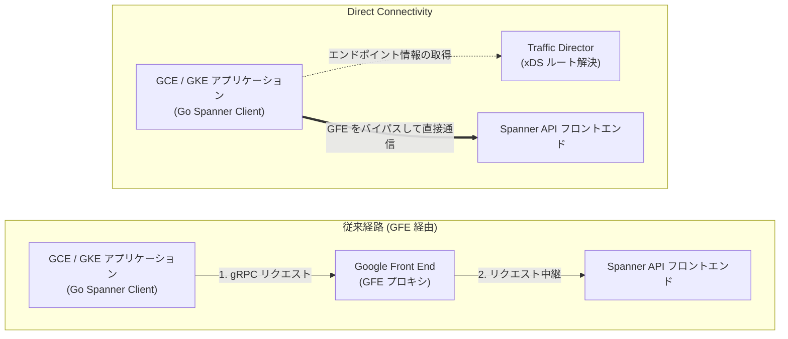

## tl;dr

- Spannerへのアクセスのレイテンシーを短くするための新機能が提供開始されました
- 2026年9月時点で対応している言語は Go と Java です
- メモリの使用量が若干増えるのでご注意ください

## はじめに

分散データベースである Cloud Spanner において、アプリケーションがクエリを実行してから応答を受け取るまでのエンドツーエンド（E2E）レイテンシーは、データベースエンジン内部の処理時間とネットワーク通信往復（RTT）の和で決まります。特に、主キー指定で 1 行を読み取る Point Read や、1 トランザクション内で複数回の SQL 実行と Commit を繰り返す OLTP ワークロードでは、Spanner サーバー内部の処理自体は短い時間で完了するため、ネットワーク経路およびプロキシ層が占める割合が相対的に大きくなります。

これまで Google Cloud 上の Compute Engine（GCE）や Google Kubernetes Engine（GKE）から Cloud Spanner に接続する通信は、すべてのリクエストが Google Cloud 共通のフロントエンドプロキシである **Google Front End（GFE）** を経由していました。これに対し、GFE をバイパスしてクライアント VM から Spanner の API フロントエンドへ直接 gRPC 通信を行う機能が [**Direct Connectivity**](https://docs.cloud.google.com/spanner/docs/latency-points#direct_connectivity) です。

本記事では、Direct Connectivity によって通信経路がどのように変化するかを解説した上で、東京リージョン（`asia-northeast1`）の最小構成である **100 Processing Units（PU）環境** と Go SDK（`cloud.google.com/go/spanner` v1.95.1）を用いて低並列度で実測したレイテンシー分布（CDF およびテールレイテンシー分析）を示します。あわせて、利用する上での留意点として公式ドキュメントで言及されている「クライアントのメモリ消費量の増加」がなぜ発生するのかを、Go ドライバの実装コードとメモリの実測値から確認します。

---

## この機能の仕組み：従来経路（GFE 経由）と Direct Connectivity の違い

従来の経路（GFE 経由）と Direct Connectivity の違いは、**「データプレーンにおけるプロキシ（GFE）のバイパス」** と **「ルーティング解決（コントロールプレーン）のクライアントサイドへの移行」** の 2 点にあります。

### 1. GFE のバイパスによる通信経路の短縮

従来の経路では、クライアントが `spanner.googleapis.com:443` に対して接続すると、通信はまず Google Front End（GFE）に到達します。GFE はリクエストを受け取った後、対象データベースが配置されているリージョンの Spanner API フロントエンドへリクエストを中継（プロキシ）していました。この構成では、GFE でのプロキシ処理によるオーバーヘッド（約 0.7〜1.5 ms）が毎回の RPC に加算されるほか、GFE 層の混雑状況やコネクション再確立に起因するテールレイテンシー（p99〜p99.9）のばらつき（ジッター）が発生する場合がありました。

一方、Direct Connectivity を有効にすると、GCE / GKE 上のクライアントは Google Cloud の内部ネットワークを介して、Spanner API フロントエンドのエンドポイント（IPv4 `34.126.0.0/18` または IPv6 `2001:4860:8040::/42`）へ **GFE を経由せずに直接 gRPC 通信** を行います。

両者の通信経路の違いを以下の図に示します。



### 2. クライアントサイドでのルート解決と `dp_check` による事前確認

GFE をバイパスする場合、「どのエンドポイント（IP アドレス）にリクエストを送るべきか」をクライアント自身が解決する必要があります。Direct Connectivity では、Google Cloud の **Traffic Director（xDS プロトコル）** から接続先のエンドポイントリストやルーティング規則を受け取ることで、クライアント側の gRPC ライブラリが適切な Spanner API フロントエンドへ直接リクエストを振り分ける仕組みになっています。

なお、稼働中の GCE VM や GKE Pod のネットワーク環境（VPC ルート、ファイアウォール、サービスアカウント権限など）において Direct Connectivity が利用可能かどうかは、Google Cloud が公開している診断ツール **`dp_check`**（[`GoogleCloudPlatform/grpc-gcp-tools`](https://github.com/GoogleCloudPlatform/grpc-gcp-tools)）を実行することで事前に判別できます。

```bash
# GCE VM / GKE Pod 上での Direct Connectivity 疎通確認コマンド
curl -sL https://github.com/GoogleCloudPlatform/grpc-gcp-tools/releases/latest/download/dp_check -o dp_check
chmod +x dp_check
./dp_check --service=spanner.googleapis.com
```

実行環境が要件を満たしていれば、以下のように Traffic Director からのエンドポイント取得およびバックエンドへの直接接続テストが `PASSED` となったことが出力されます。

```text
Running on GCP: PASSED
IPv4 address allocated to VM's primary NIC: PASSED
Xds bootstrap environment variable: PASSED
...
Secure connectivity to IPv4 backends from Traffic Director: PASSED
```

---

## 実測検証：100 PU・低並列度でのレイテンシー変化

Direct Connectivity の効果を確認するため、東京リージョン（`regional-asia-northeast1`）の **100 Processing Units（PU）** インスタンスに対してベンチマークを実施しました。

### 測定における 2 つの注意点（低並列度と試行回数）

100 PU 環境でネットワーク経路の差を正確に測るにあたっては、以下の 2 点に配慮して実験を設計しました。

1. **サーバー CPU 負荷を避けるための低並列度（Concurrency = 1 / 4）での測定**
   100 PU（0.1 Node 相当）のインスタンスは、提供されるサーバー CPU リソースが小さく制限されています。もしクライアントから高い並列度で負荷を掛けると、Spanner インスタンス側の CPU 使用率が飽和し、サーバー内部での処理待ちやトランザクションのロック競合が発生します。その結果、リクエストあたりの所要時間が長くなり、Direct Connectivity が短縮する「約 0.7〜1.5 ms のネットワーク＋プロキシ差分」がサーバー側の処理時間に埋もれてしまいます。そこで本検証では、サーバー側の CPU 使用率を 10% 未満の余裕ある状態に保ち、通信経路の差のみを抽出するため、**Concurrency = 1（直列実行）** および **Concurrency = 4（Go SDK のデフォルト gRPC チャネル数に合わせた 4 並列）** の低並列度で計測を行いました。
2. **内部ハウスキーピング処理による変動を均すための十分な試行回数**
   公式ドキュメントにも記載がある通り、100 PU のような小さなインスタンス構成では、コンパクションなどの Spanner 内部のハウスキーピング処理（バックグラウンドタスク）によって一時的にレイテンシーが変動することがあります。そのような一時的な変動の影響を均して評価できるよう、事前に 200 回の Warmup を行った上で、Point Read では 3,000〜4,000 回、Read-Write トランザクションでは 1,000 回の試行回数を計測しています。

### 測定環境とワークロード仕様

* **クライアント環境**：Compute Engine `n4-standard-2`（2 vCPU, 8 GB RAM, 東京 `asia-northeast1-b`）
* **Spanner 環境**：`regional-asia-northeast1` 構成、**100 Processing Units**
* **ソフトウェア**：Go 1.26.0、`cloud.google.com/go/spanner` v1.95.1、`google.golang.org/grpc` v1.82.1
* **対象テーブル**：主キー `id INT64` と `name STRING(MAX)` のみを持つシンプルな `PoC_Users` テーブル（セカンダリインデックスなし、100行投入済み）
* **比較条件**：
  1. **GFE 経由（従来経路）**：`GOOGLE_SPANNER_ENABLE_DIRECT_ACCESS=false`
  2. **Direct Connectivity**：`GOOGLE_SPANNER_ENABLE_DIRECT_ACCESS=true`
* **測定ワークロード**：
  * **Point Read (`Concurrency = 1`, 3,000 samples)**：`client.Single().ReadRow` による 1 行読み取り（1 リクエスト＝**1 RPC 往復**）。
  * **Point Read (`Concurrency = 4`, 4,000 samples)**：4 ゴルーチンから同時に `ReadRow` を実行。
  * **Read-Write Transaction DML (`Concurrency = 1`, 1,000 samples)**：`client.ReadWriteTransaction` 内で `UPDATE PoC_Users SET name = @name WHERE id = @id` を実行。Go SDK の `InlineBegin` 最適化により、トランザクション開始は最初の `ExecuteSql` に含まれるため、1 トランザクション＝**2 RPC 往復（`ExecuteSql` + `Commit`）** となります。

### 実測結果サマリ

計測によって得られたレイテンシー統計値（単位：ミリ秒）を以下の表に示します。

| ワークロード | 接続経路 | Mean (平均) | StdDev (標準偏差) | Min (最小) | p50 (中央値) | p90 | p95 | p99 | p99.9 |
| :--- | :--- | :---: | :---: | :---: | :---: | :---: | :---: | :---: | :---: |
| **Point Read (c=1)**<br>*(1 RPC / Req)* | GFE 経由 (従来) | 3.38 ms | 3.28 ms | 1.64 ms | **2.77 ms** | 3.97 ms | 5.26 ms | **19.21 ms** | **43.30 ms** |
| | **Direct Connectivity** | **2.20 ms** | **0.71 ms** | **0.93 ms** | **2.03 ms** | **3.11 ms** | **3.33 ms** | **4.14 ms** | **8.33 ms** |
| | *短縮効果 (差分 / 割合)* | *-1.18 ms (-35%)* | *-2.57 ms (-78%)* | *-0.71 ms* | ***-0.74 ms (-27%)*** | *-0.86 ms (-22%)* | *-1.93 ms (-37%)* | ***-15.07 ms (-78%)*** | ***-34.97 ms (-81%)*** |
| **Point Read (c=4)**<br>*(1 RPC / Req)* | GFE 経由 (従来) | 3.03 ms | 1.13 ms | 1.48 ms | **2.81 ms** | 3.94 ms | 4.33 ms | 6.35 ms | 16.08 ms |
| | **Direct Connectivity** | **2.59 ms** | 2.52 ms | **0.85 ms** | **2.13 ms** | **3.71 ms** | 4.85 ms | 15.19 ms | 31.79 ms |
| | *短縮効果 (差分 / 割合)* | *-0.44 ms (-15%)* | *+1.39 ms* | *-0.63 ms* | ***-0.68 ms (-24%)*** | *-0.23 ms (-6%)* | *+0.52 ms* | *+8.84 ms* | *+15.71 ms* |
| **Read-Write Txn (c=1)**<br>*(2 RPCs: Update+Commit)* | GFE 経由 (従来) | 23.17 ms | 16.47 ms | 6.74 ms | **16.78 ms** | 49.94 ms | 60.82 ms | **74.44 ms** | **122.48 ms** |
| | **Direct Connectivity** | **16.81 ms** | **8.73 ms** | **6.16 ms** | **14.84 ms** | **23.57 ms** | **32.10 ms** | **53.64 ms** | **91.72 ms** |
| | *短縮効果 (差分 / 割合)* | *-6.36 ms (-27%)* | *-7.74 ms (-47%)* | *-0.58 ms* | ***-1.94 ms (-12%)*** | ***-26.37 ms (-53%)*** | ***-28.72 ms (-47%)*** | ***-20.80 ms (-28%)*** | ***-30.76 ms (-25%)*** |

### グラフによる可視化（CDF とテールレイテンシーの比較）

レイテンシーの変化を視覚化する際、**CDF（累積分布関数）** は「分布全体がどの程度低レイテンシー側へシフトしたか」を把握するのに適しています。一方で、通常の線形 Y 軸（0.0〜1.0）の CDF では、**「p99（0.99）〜p99.9（0.999）のテールレイテンシー領域がグラフの上端 1% の領域に集約されてしまい、スパイクの抑制効果が見えにくい」** という側面があります。

そのため、本検証では CDF に加えて、**主要パーセンタイル別の棒グラフ** および Y 軸を超過確率 $P(\text{Latency} > x) = 1 - \text{CDF}(x)$ の対数スケールで表した **CCDF（相補累積分布関数）** を並置して可視化しました。


グラフと数値から、以下の 3 つの傾向が読み取れます。

1. **ベースライン RTT の短縮（p50 で約 0.74 ms 短縮、最小値で 1 ms 未満に到達）**
   左上パネル（Point Read c=1 の CDF）を見ると、Direct Connectivity（青線）は GFE 経由（灰色破線）に対して曲線全体が左へ約 0.7〜0.8 ms 平行移動しています。中央値（p50）は `2.77 ms` から `2.03 ms` へと **26.8% 短縮** され、最小値（Min）は `1.64 ms` から **`0.93 ms`（1 ミリ秒未満）** に達しています。同一リージョン内の通信において、GFE プロキシを経由しない分の RTT 短縮が確認できます。
2. **GFE 起因のテールレイテンシースパイク（ジッター）の抑制**
   右上パネル（パーセンタイル棒グラフ）および右下パネル（対数 CCDF）に注目すると、GFE 経由では p95（`5.26 ms`）を超えたあたりからロングテールが発生し、p99 で `19.21 ms`、p99.9 で `43.30 ms` まで上昇しています（標準偏差 `3.28 ms`）。これに対し、Direct Connectivity では p99 が **`4.14 ms`（-15.07 ms / 78.4% 削減）**、p99.9 でも **`8.33 ms`（-34.97 ms / 80.8% 削減）** に収まっており、標準偏差は **`0.71 ms`（約 4.6 分の 1）** に縮小しています。右下 CCDF グラフにおいて青線が急角度で低下しているのは、プロキシ層起因のジッターが抑えられたことを示しています。
3. **複数回 RPC を往復するトランザクションでの累積短縮効果と、100 PU 環境における並列負荷の境界**
   左下パネルの Read-Write Transaction（1 トランザクションあたり `ExecuteSql` + `Commit` の 2 RPC 往復）では、p50 の短縮幅が **`-1.94 ms`（16.78 ms → 14.84 ms）** となっており、1 RPC あたりの短縮幅（約 0.7〜1.0 ms）が 2 往復分積み上がっています。さらに p90 では `49.94 ms → 23.57 ms`（**-26.37 ms / 52.8% 削減**）と改善が見られます。
   一方、Point Read を Concurrency = 4（`PointRead_c4`）に上げたケースを見ると、p50 は `2.81 ms → 2.13 ms`（**-0.68 ms / 24% 短縮**）と速くなっているものの、p99 領域では `15.19 ms` とばらつきが生じています。これは Direct Connectivity によってリクエストの往復間隔（RTT）が短くなった結果、4 並列でも秒間 1,500 QPS 以上の負荷が 100 PU（0.1 Node）の Spanner インスタンスに到達し、サーバー側の処理待ちが発生し始めたためです。100 PU 環境でネットワーク本来の差分を見るには Concurrency = 1 の低並列測定が適していることがここからも確認できます。

---

## 利用する上での留意点：クライアントのメモリ消費量について

Google Cloud の公式ドキュメントに記載されている通り、Direct Connectivity を有効にすると、クライアントインスタンスあたり **約 10〜20 MB のメモリ消費量の増加** が発生します。

なぜ接続経路の変更によってメモリ消費量が増えるのか、Go SDK（`cloud.google.com/go/spanner` v1.95.1）の実装コードと実機のメモリ計測結果からその仕組みを確認します。

### コードレベルで読み取れるメモリ増加の仕組み

#### 1. フォールバック用コネクションプールの保持

主要な要因は、Direct Connectivity の経路に万が一問題が生じた際、リクエストを失敗させずに従来の GFE 経由へ即座に切り替えられるよう、クライアント内部で **フォールバック用のコネクションプールもあわせて保持する実装** になっていることです。`cloud.google.com/go/spanner` の `client.go` におけるコネクションプール作成処理を確認すると、以下のように実装されています。

```go
// cloud.google.com/go/spanner/client.go (OSS 実装コードより抜粋)
func createConnPool(ctx context.Context, config ClientConfig, ...) (gtransport.ConnPool, []option.ClientOption, error) {
    ...
    allOpts := allClientOpts(config.NumChannels, config.Compression, config.EnableDirectAccess, opts...)
    // 1. Direct Connectivity 用のプライマリコネクションプールを作成 (デフォルト 4 チャネル)
    primaryConn, err := gtransport.DialPool(ctx, allOpts...)
    if err != nil {
        return nil, nil, err
    }

    // 2. 通信障害時に即座に GFE 経由へ退避するためのフォールバックプールを作成 (4 チャネル)
    fallbackConnOpts := append(allOpts, internaloption.EnableDirectPath(false))
    fallbackConn, err := gtransport.DialPool(ctx, fallbackConnOpts...)
    if err != nil {
        primaryConn.Close()
        return nil, nil, err
    }
    ...
    // 3. 2 つのプールをラップし、エラー発生時の自動フォールバックを構成
    gcpFallback, err := grpcgcp.NewGCPFallback(ctx, primaryConn, fallbackConn, fbOpts)
    return &fallbackWrapper{gcpFallback, primaryConn, fallbackConn}, allOpts, nil
}
```

Spanner Go クライアントはデフォルトで `NumChannels = 4` 本の gRPC チャネルを作成します。Direct Connectivity 有効時は、`primaryConn`（直接通信用の 4 チャネル）に加えて、退避用の `fallbackConn`（GFE 経由の 4 チャネル）が同時に初期化・維持されるため、1 つの `spanner.Client` インスタンス内で保持されるチャネル構造体が 2 倍（計 8 チャネル分）になります。

#### 2. エンドポイント管理（xDS）と Go ランタイムのヒープ予約（`HeapSys`）

フォールバックプールの保持に加え、従来 GFE 側で行っていた接続先エンドポイントリストの管理やヘルスチェック（xDS クライアントおよびルートキャッシュ）をクライアントプロセスのメモリ上で処理するため、生存ヒープ（`HeapAlloc`）が数 MB 増加します。また、これに伴い通信やヘルスチェックを管理するバックグラウンドのゴルーチンも追加で動作します（ただし、一般的な Web アプリケーション等では元々多くのゴルーチンが動作するため、Direct Connectivity に関連するゴルーチンの増加分はアプリケーション全体から見れば相対的にわずかです）。

ここで Go ランタイムのメモリ管理の特性として、ガベージコレクタ（デフォルト `GOGC=100`）は GC 終了時点の生存ヒープ（`HeapAlloc`）やゴルーチンスタックに対して、**約 2 倍のメモリ空間を次回 GC 発動のターゲット（Heap Target）として OS から予約・維持（`HeapSys`）** します。

そのため、xDS キャッシュやフォールバックプールによって生存ヒープ（`HeapAlloc`）が約 3〜4 MB 増加すると、Go ランタイムが OS から確保する物理メモリ（`VmRSS`：Resident Set Size）としてはその約 2 倍にあたる **約 8〜10 MB（負荷状況によっては 10〜20 MB）の増加** となって現れます。

### 実機でのメモリ消費量計測結果

GCE VM（`bastion`）上で `spanner.Client` インスタンスを **1 個作成した場合** と、複数のデータベースへ接続するケースを想定して **5 個作成した場合** のそれぞれについて、Warmup 完了後に `runtime.GC()` を実行した状態（Post-GC）のメモリ統計（`runtime.ReadMemStats` および Linux `/proc/self/status` の `VmRSS`）を計測しました。


実測された各メトリクスの数値を以下の表に示します。

| クライアント数 | 接続経路 | Goroutines<br>(`NumGoroutine`) | HeapAlloc<br>*(生存ヒープ)* | HeapInuse<br>*(使用中スパン)* | HeapSys<br>*(GC Target / 予約済)* | VmRSS (Post-GC)<br>*(OS 実メモリ消費)* | VmRSS (Pre-GC)<br>*(GC 前ピーク RSS)* |
| :--- | :--- | :---: | :---: | :---: | :---: | :---: | :---: |
| **0 (Baseline)** | 起動直後・接続前 | 14 | 4.47 MB | 7.69 MB | 19.34 MB | 36.84 MB | — |
| **1 Client**<br>*(標準構成)* | GFE 経由 (従来) | 37 | 3.17 MB | 4.95 MB | 11.53 MB | 32.04 MB | 33.35 MB |
| | **Direct Connectivity** | **177** | **6.63 MB** | **10.47 MB** | **19.00 MB** | **39.99 MB** | **42.84 MB** |
| | *1 Client あたりの増分* | ***+140 goroutines*** | ***+3.46 MB*** | ***+5.52 MB*** | ***+7.47 MB*** | ***+7.95 MB*** | ***+9.49 MB*** |
| **5 Clients**<br>*(複数 DB 接続)* | GFE 経由 (従来) | 161 | 5.02 MB | 7.62 MB | 15.13 MB | 35.11 MB | 37.55 MB |
| | **Direct Connectivity** | **769** | **14.09 MB** | **21.28 MB** | **36.88 MB** | **52.55 MB** | **59.97 MB** |
| | *5 Clients 合計の増分* | *+608 goroutines* | *+9.07 MB* | *+13.66 MB* | *+21.75 MB* | *+17.44 MB* | *+22.42 MB* |
| | *1 Client あたりの平均増分* | ***+121.6 / client*** | ***+1.81 MB / client*** | ***+2.73 MB / client*** | ***+4.35 MB / client*** | ***+3.49 MB / client*** | ***+4.48 MB / client*** |

### メモリ分析から得られる運用上の指針

1. **1 クライアントあたりの実メモリ（RSS）増分は約 8.0〜9.5 MB**
   単一の `spanner.Client` を使用する標準的な構成では、Direct Connectivity を有効にすると生存ヒープ（`HeapAlloc`）が **+3.46 MB** 増加し、Go ランタイムの GC Target（`HeapSys`）の予約とあわせて、OS 上の物理メモリ消費量（`VmRSS`）は Post-GC で **+7.95 MB**（GC 前のピーク時で **+9.49 MB**）増加します。公式ガイドに記載されている「クライアントあたり約 10〜20 MB のメモリ増加」という目安とよく一致しています。
2. **複数クライアント生成時の xDS クライアント共有効果**
   5 個の `spanner.Client` を生成したケースでは、1 クライアントあたりの平均増分は `HeapAlloc` で **+1.81 MB**、Post-GC の `VmRSS` で **+3.49 MB** へと減少しています。これは `grpc-go` の xDS クライアント実装がプロセス内で共有される部分があり、Traffic Director との通信キャッシュの一部が複数クライアント間で再利用されるためです。
3. **`spanner.Client` のシングルトン再利用の確認**
   通常の GCE VM や GKE Pod（数 GB 以上のメモリを搭載）において、プロセスあたり 10 MB 前後のメモリ増加が問題になることはほとんどありません。ただし、リクエストごとに `spanner.NewClient` を生成・破棄するような実装を行っている場合や、コンテナのメモリ上限（Memory Limit）を 128 MB〜256 MB といった小さなサイズに切り詰めている環境では注意が必要です。基本原則通り **`spanner.Client` をアプリケーション起動時に 1 度だけ初期化して使い回す（シングルトンパターン）** こと、およびコンテナのメモリ制限に 20 MB 程度の余裕を持たせておくことを推奨します。

---

## 有効化の手順と運用上のチェックリスト

Direct Connectivity を導入する際の要件と設定手順を整理します。

### 1. 導入の前提条件（Prerequisites）

* **実行環境**：クライアントが Google Compute Engine（GCE）または Google Kubernetes Engine（GKE）上で稼働していること（Cloud Run などの環境からは Direct Connectivity の直接経路は利用できず、自動的に GFE 経由の通信へフォールバックします）。
* **同一リージョン配置（推奨）**：クライアント VM / Pod と Spanner インスタンスが同一リージョン（例：ともに `asia-northeast1`）に配置されていること。
* **SDK バージョン**：
  * Go：`cloud.google.com/go/spanner` **v1.63.0 以降**（クライアントサイドメトリクスがデフォルト有効化された **v1.71.0 以降** を推奨）
  * Java：`google-cloud-spanner` **v6.62.0 以降**（メトリクス対応の **v6.81.0 以降** を推奨。なお、既知の互換性問題がある `grpc-java` 1.75.0〜1.77.0 / `java-spanner` 6.103.0〜6.104.0 は避けて最新安定版を使用してください）
* **ネットワーク・ファイアウォール要件**：VPC のルートおよび下り（Egress）ファイアウォールルールにて、Direct Connectivity 用のエンドポイント IP 範囲である **`34.126.0.0/18`（IPv4）** および **`2001:4860:8040::/42`（IPv6）** への TCP 通信が許可されていること。
* **IAM 権限**：クライアントのサービスアカウントに `spanner.databases.get` 権限が付与されていること（データベース単位のルーティングメタデータ取得に必要です）。

### 2. 有効化の設定方法

アプリケーションコードを変更することなく、環境変数を 1 つ設定してプロセスを再起動するだけで有効化できます。

```bash
# 環境変数による Direct Connectivity の有効化（Go / Java 共通）
export GOOGLE_SPANNER_ENABLE_DIRECT_ACCESS=true
```

Go のコード内で明示的に制御したい場合は、`spanner.ClientConfig` の `EnableDirectAccess` フィールドに `true` を指定します。

```go
cfg := spanner.ClientConfig{
    EnableDirectAccess: true,
    NumChannels:        4,
}
client, err := spanner.NewClientWithConfig(ctx, databaseName, cfg)
```

### 3. Cloud Monitoring でのメトリクス確認

Go SDK v1.71.0 以降では、Cloud Monitoring へクライアントサイドメトリクス（`spanner.googleapis.com/client/operation_latencies` など）が自動送信されます。メトリクスのラベルとして付与される **`directpath_enabled`**（設定が有効か）および **`directpath_used`**（実際にリクエストが Direct Connectivity 経路で処理されたか）をフィルタリングすることで、直接通信が利用されているかどうかやレイテンシーの改善幅を Cloud Monitoring 上で確認できます。

---

## まとめ

Cloud Spanner の Direct Connectivity について、その仕組みと 100 PU 環境での実測結果、および利用する上での留意点を確認しました。

* **仕組み**：Google Front End（GFE）プロキシをバイパスし、Traffic Director（xDS）から取得したエンドポイント情報を用いてクライアントから Spanner API フロントエンドへ直接 gRPC 通信を行います。実行環境で利用可能かどうかは公開ツール `dp_check` で事前に確認できます。
* **レイテンシー改善効果**：東京リージョン 100 PU 環境・Go クライアントの低並列実測において、Point Read の中央値（p50）が **`2.77 ms → 2.03 ms`（-26.8%）**、最小値が **`0.93 ms`（1 ミリ秒未満）** に短縮されました。さらに GFE 通過時に発生していた p99（`19.21 ms → 4.14 ms`、**-78.4% 削減**）や p99.9（`43.30 ms → 8.33 ms`、**-80.8% 削減**）のテールレイテンシーのばらつきが抑えられ、標準偏差が **約 4.6 分の 1**（`3.28 ms → 0.71 ms`）に縮小しました。
* **複数 RPC トランザクションへの効果**：`ExecuteSql` + `Commit` の 2 往復を伴う Read-Write トランザクションでは、1 トランザクションあたり p50 で **`-1.94 ms`**、p90 で **`-26.37 ms`（-52.8%）** と、RPC の往復回数に応じて短縮効果が積み上がります。
* **メモリ消費量の留意点**：障害時に即座に GFE 経由へ退避するためのフォールバック用コネクションプールを保持すること、およびエンドポイント管理データ構造をクライアント側で保持することにより、生存ヒープが約 +3.5 MB 増加します。これが Go ランタイムの GC Target（`HeapSys`）の予約によって約 2 倍の領域として確保され、**1 クライアントあたり約 8〜10 MB（公式ガイドの記載では約 10〜20 MB）のメモリ増加** として観測されます。`spanner.Client` のシングルトン再利用を行っていれば実用上の支障になることは少なく、環境変数 1 つ（`GOOGLE_SPANNER_ENABLE_DIRECT_ACCESS=true`）で導入できる有用な機能です。
