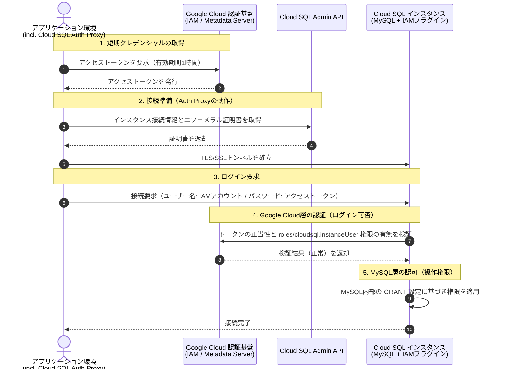

## Cloud SQLにおけるIAM認証の役割

オンプレミスやIaaS上に構築したセルフマネージドのデータベース運用では、データベース内部に静的なユーザー名とパスワードを発行して管理してきました。
この方式には、ソースコードや設定ファイルへのパスワードのハードコード、定期的なパスワードローテーションの運用負荷、担当者の異動や退職に伴う権限剥奪の遅れといった課題が伴います。

Cloud SQLのIAM認証は、データベースへのログイン認証をGoogle Cloudの認証基盤（IAM）に委譲する仕組みです。
静的なパスワードを廃止し、有効期間が最大1時間のアクセストークンを認証に利用します。

IAM認証を導入することにより、パスワードの定期ローテーション運用が不要になります。
実行環境（Compute Engine、Cloud Runなど）のメタデータサーバーやCloud SQL Auth Proxyが、バックグラウンドで短命なアクセストークンを自動取得して破棄するためです。
また、権限の付与や剥奪をGoogle CloudのIAM側で一元管理できるため、組織変更時にも即座にアクセス権を無効化できます。

認証の主体となるアカウント全般（個人のGoogleアカウント、プログラム実行用のサービスアカウント、Googleグループなど）を一般的に**IAMプリンシパル**と呼びます。

## 処理の流れとアーキテクチャ

IAM認証の全体像を理解するには、通信に関わる3つのコンポーネントと、その間の通信順序を把握する必要があります。

1. **アプリケーション環境**：接続を行うクライアントプログラム、および補助ツールであるCloud SQL Auth Proxy
2. **Google Cloud認証基盤**：IAM、インスタンスメタデータサーバー、Cloud SQL Admin API
3. **Cloud SQLインスタンス**：MySQLデータベースエンジン、および内部で動作するIAM認証プラグイン

### 認証・接続シーケンス

アプリケーションがIAM認証を用いてCloud SQLに接続する際の一連の通信フローは、次の通りです。



### インフラ層とデータベース層の分離

このシーケンスが示す通り、IAM認証ではDBの中にさらに2つの層に分解できます。

- **Google Cloud層（インフラ・認証）**：
  上記フローのステップ4に対応します。
  「そのIAMプリンシパルが、対象のCloud SQLインスタンスにログインする資格を持つか」を検証します。
- **MySQL層（データベース・認可）**：
  上記フローのステップ5に対応します。
  「ログインを許可されたユーザーが、どのデータベースやテーブルを読み書きできるか」を制御します。

IAMロールを付与しただけではMySQL内部のテーブル操作権限が決まらず、MySQL側で権限（GRANT）を与えただけではGoogle Cloud層でインスタンスへの接続自体が拒否されます。
双方が揃って初めてデータベース接続が成立します。

### Cloud SQL Auth Proxyがなぜ必要か

Google Cloudが発行するアクセストークンの有効期間は1時間です。
トークンを手動で取得し、MySQLクライアントのパスワード欄に入力して接続する「手動認証」では、接続から1時間が経過した時点で再接続や新規接続の確立が不可能になります。
常駐プロセスや接続プールを維持する一般的なWebアプリケーションにおいて、手動認証は実用性に耐えません。

Cloud SQL Auth Proxy（または各種プログラミング言語向けCloud SQLコネクタ）は、バックグラウンドでメタデータサーバー等から最新のアクセストークンを自動取得し、更新し続けます。
これにより、アプリケーション側はトークンの寿命を意識することなく、安定した接続を維持できます。

## 3. IAM認証を構成する4つの設定手順

前述の通信フローに基づき、設定作業は4つのステップに分かれます。

### ステップ1：インスタンスのIAM認証フラグの有効化

Cloud SQLインスタンス側で、IAM認証プラグインを有効化します。

```bash
gcloud sql instances patch INSTANCE_NAME \
    --database-flags=cloudsql.iam_authentication=on
```

この設定により、MySQL内部で `cloudsql_iam_authentication` 認証プラグインが有効化され、アクセストークンを用いたログイン検証を受け付ける状態になります。

### ステップ2：接続元アカウントへのIAMロール付与

接続を行うIAMプリンシパル（作業者のGoogleアカウントまたはアプリケーションのサービスアカウント）に対し、Google Cloudのプロジェクト単位またはインスタンス単位でIAMロールを付与します。

必要なロールは以下の2点です。

- **`roles/cloudsql.client`（Cloud SQL クライアント）**：
  Cloud SQL Admin APIと通信し、インスタンスの接続メタデータ取得やTLSトンネルの確立を行うために必要です（通信フローのステップ2に対応）。
- **`roles/cloudsql.instanceUser`（Cloud SQL インスタンス ユーザー）**：
  Cloud SQLインスタンスがIAMに対してログイン可否を検証する際に、インスタンスへのログイン権限（`cloudsql.instances.login`）を確認するために必要です（通信フローのステップ4に対応）。

```bash
# 接続トンネル確立用ロールの付与
gcloud projects add-iam-policy-binding PROJECT_ID \
    --member="serviceAccount:sa-name@PROJECT_ID.iam.gserviceaccount.com" \
    --role="roles/cloudsql.client"

# データベースログイン用ロールの付与
gcloud projects add-iam-policy-binding PROJECT_ID \
    --member="serviceAccount:sa-name@PROJECT_ID.iam.gserviceaccount.com" \
    --role="roles/cloudsql.instanceUser"
```

### ステップ3：MySQL内部でのユーザー作成と権限付与

データベース管理者権限を持つアカウントでMySQLに接続し、IAMプリンシパルに対応するデータベースユーザーを作成します。

```sql
-- Googleアカウント（人間）の場合
CREATE USER 'user@example.com'@'%' IDENTIFIED WITH cloudsql_iam_authentication;
GRANT SELECT, INSERT, UPDATE, DELETE ON app_db.* TO 'user@example.com'@'%';

-- サービスアカウントの場合（後述のドメイン省略ルールを適用）
CREATE USER 'sa-name'@'%' IDENTIFIED WITH cloudsql_iam_authentication;
GRANT SELECT, INSERT, UPDATE, DELETE ON app_db.* TO 'sa-name'@'%';

FLUSH PRIVILEGES;
```

`IDENTIFIED WITH cloudsql_iam_authentication` を明示してユーザーを作成することで、MySQLはパスワードハッシュの照合を行わず、Cloud SQLのIAM検証機構へ処理を委譲します。

### ステップ4：Auth Proxyを用いた接続

アプリケーション環境でCloud SQL Auth Proxyを起動します。
起動時に自動IAM認証フラグ（`--auto-iam-authn`）を付与します。

```bash
cloud-sql-proxy PROJECT_ID:REGION:INSTANCE_NAME \
    --port 3306 \
    --auto-iam-authn
```

Auth Proxyが起動したら、MySQLクライアントやアプリケーションから接続します。
パスワードの入力は不要（または空文字）とし、ユーザー名には作成したIAMアカウント名を指定します。

```bash
# Googleアカウントで接続する場合
mysql -h 127.0.0.1 -P 3306 -u "user@example.com"

# サービスアカウントで接続する場合
mysql -h 127.0.0.1 -P 3306 -u "sa-name"
```

## 仕様と制約の技術的背景

### なぜSSL/TLS接続が必須なのか

MySQLの一般的なパスワード認証（`caching_sha2_password` や `mysql_native_password` など）は、チャレンジ&レスポンス方式を採用しています。
認証処理においてパスワードの平文そのものが通信路上に送信されることはありません。

一方、Cloud SQLのIAM認証は、OAuth 2.0アクセストークンをパスワード属性としてそのまま送信するクリアテキスト認証の形式をとります。
通信経路が暗号化されていない場合、有効なアクセストークンが平文でネットワーク上を流れ、容易に盗聴される危険があります。
この構造的リスクを排除するため、Cloud SQLではIAM認証時の暗号化通信（SSL/TLS接続）が必須要件として組み込まれています。
Cloud SQL Auth Proxyを利用する場合は、Proxyとインスタンス間の通信が自動的にTLSで保護されます。

### サービスアカウントのユーザー名が短縮される理由

MySQLのユーザー名には文字数制限（最大32文字）が存在します。
Google Cloudのサービスアカウントのメールアドレス（例：`sa-name@project-id.iam.gserviceaccount.com`）は、この制限を容易に超過します。

この仕様上の制約を回避するため、Cloud SQL for MySQLではサービスアカウントの末尾にあるドメイン部分（`.gserviceaccount.com`）を切り捨ててデータベースユーザー名として登録するルールが設けられています。
プロジェクトIDを含めた名前が32文字に収まらない場合は、さらに短縮した形式（アカウントのプレフィックス部分のみ）が使用されます。

### IAMグループ認証（Cloud Identity Groups）の位置づけ

個別のアカウントごとに `CREATE USER` や `GRANT` を実行する運用は、開発者の出入りが多い組織において運用のボトルネックとなります。
この課題を解消するために用意されているのが[IAMグループ認証](https://docs.cloud.google.com/sql/docs/mysql/iam-authentication?hl=ja#iam-group-auth)です。

グループ認証では、Cloud Identityグループに対してMySQL内部でユーザー作成と権限付与を事前に行います。
運用管理者はGoogleグループにメンバーを追加または削除するだけで、データベースへのアクセス権を制御できます。

ただし、グループ認証は個別アカウントでの認証機構の上に成り立つ拡張機能です。
まずは個別アカウントでの認証フローを理解した上で、組織の規模や運用体制に応じて導入を検討するのが適切な順序です。
